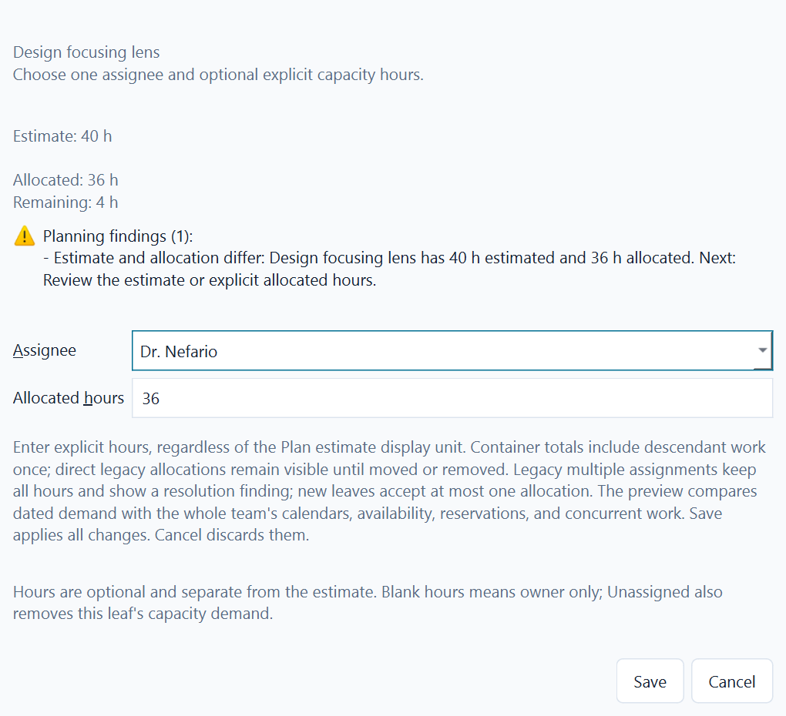
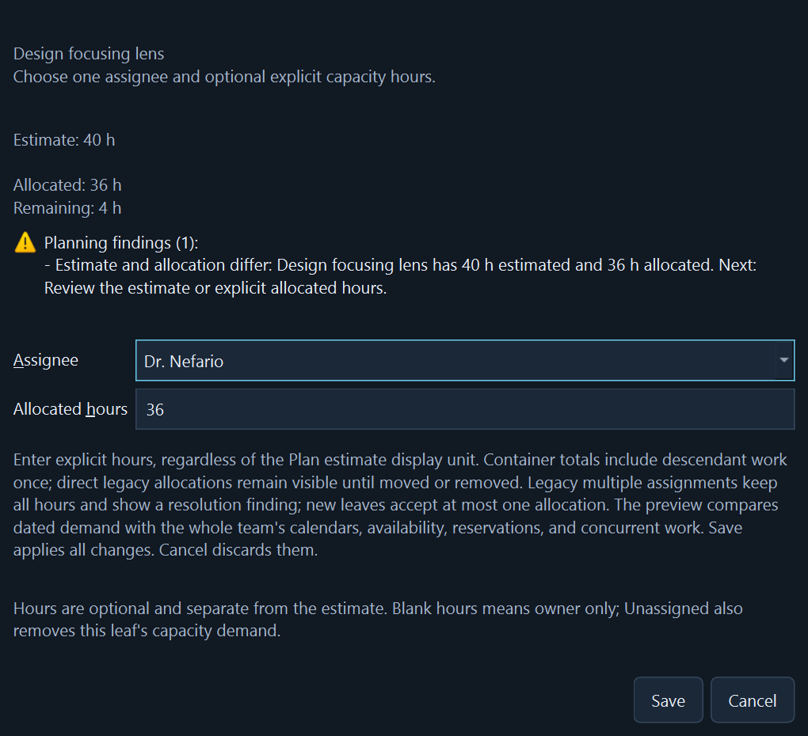

# Work allocations

An `Allocation` is an explicit link between one WorkItem and one Person, with
its own UUID and finite, non-negative Decimal hours. Several people can share
one task, such as 60 hours for Alex and 40 hours for Sam on a 100-hour task.
It is separate from work ownership, Jira assignees, and personal availability.

The v0.4 calculation foundation in [#70](https://github.com/tidus747/planacity/issues/70)
provides `domain.allocation.Allocation` and the pure
`planning.allocations.validate_allocations` / `summarize_allocations` functions.
Pass a ProgramPlan and an immutable tuple of candidate allocations. References
must exist in the plan. Allocation IDs and work/person pairs must be unique;
edit an existing allocation instead of adding another entry for the same pair.

The summary returns all work and people in canonical plan/roster order. It sums
each explicit allocation ID once. For each work item:

- A leaf uses its entered estimate. A container's effective estimate is the exact
  recursive sum of descendant leaves; its entered estimate remains reference data.
- `known_estimate_hours` and `missing_estimate_count` distinguish a partial
  subtotal from a complete zero. A complete `estimate_hours` is available only
  when every leaf estimate is known.
- `direct_allocated_hours`, `descendant_allocated_hours`, and `allocated_hours`
  explain the exact subtree total without duplicating an allocation ID.
- `remaining_hours` is the complete effective estimate minus the subtree's
  allocated hours. It is unknown when estimates are missing or the container has
  unresolved direct allocations. A negative value identifies excess allocation.
- `unassigned` means no positive effort has been allocated. A zero-hour entry is
  retained as explicit data but does not make work positively allocated.

Partial allocation, allocation beyond an estimate, and work without an estimate
are allowed so incomplete plans remain visible. The calculation never changes
estimates, rescales allocations, assigns imported users, or rewrites baselines.
Decimal totals retain all input precision even under a low caller precision.

Existing plans may contain entered estimates or allocations on containers. The
estimate is shown separately as reference and is not added to leaf effort. Direct
container allocations stay visible and count once, but make the summary incomplete;
direct and descendant allocations together are marked mixed-level effort. Use
**Move direct effort to leaf...** to create a named child, clear the container's
entered estimate, and move its direct allocations while preserving their IDs and
hours. No dates, groups, relationships, or imported baselines move with them.

New allocations target leaf work. Adding or moving the first child under an
allocated leaf previews the same transfer and requires an explicit choice; Cancel
preserves the original plan. Dates outside the horizon do not discard allocations.
No date distribution, capacity comparison, or productivity measure is implied.

## Edit allocations in Plan

Select a work item, then choose **Work allocations...** in Selected work.
Add a roster member and explicit hours, or select an existing row to Edit or
Remove it. Hours remain hours even when Plan displays estimates in days or weeks.
Save applies the complete draft. Cancel or Escape discards it. Use Tab to move
between controls and Alt+A / Alt+E / Alt+R for allocation actions.

The summary reports effective estimate, entered reference, direct and descendant
allocation, and remaining effort. Missing estimates, mixed levels, and excess
allocation remain visible. The findings preview also distributes dated demand
through the shared capacity engine and compares it with every concurrent
allocation, calendar, availability entry, and reservation in the candidate plan.
Findings are advisory: Save keeps an infeasible or incomplete draft visible for
later correction instead of silently changing or rejecting its hours.

Deletion of a person or work item previews affected allocations and requires
confirmation. Deleting a parent includes hidden descendants. Surviving allocation
IDs remain stable. Jira assignees never create allocations automatically, and
allocation edits do not change imported baselines or Jira CSV effort units.

ProgramPlan stores allocations, introduced in schema 7, in current schema 10
SQLite projects and JSON backups.
Schemas 1-6 load with an empty collection. Keep an original backup or use Save As
if an older build must still open the project.

The same overload finding from all concurrent work remains readable in the
allocation draft in both appearances: [light](images/planning-findings-light.png)
and [dark](images/planning-findings-dark.png).

For a quick evaluation, split a 100-hour task into 60 and 40 hours, save and reopen,
then edit one entry and cancel. Check that the saved totals remain unchanged.
The shared dated capacity engine now consumes explicit allocations without
changing their hierarchy or storage. It spreads each person's hours across the
WorkItem's complete dates using positive planning capacity after reservations,
then sums concurrent work and retains negative remaining capacity. Missing dates,
calendars, or positive-capacity days keep the hours as explicit unplaced demand.

The [roadmap](roadmap.md) continues with R06 to present the same capacity totals
in People. See the
[planning decisions](planning-decisions.md) for the dated distribution contract.
