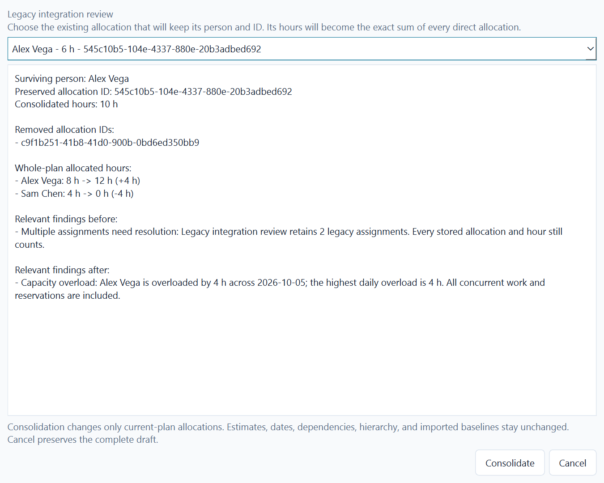
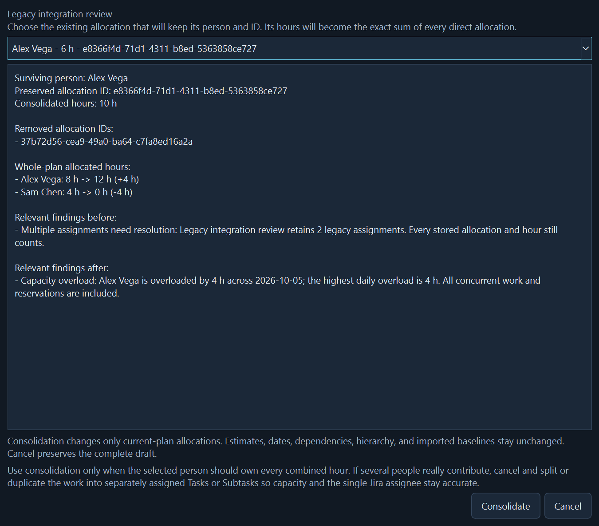
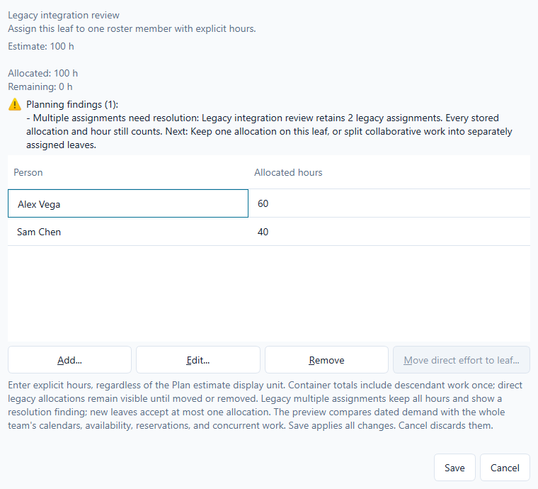
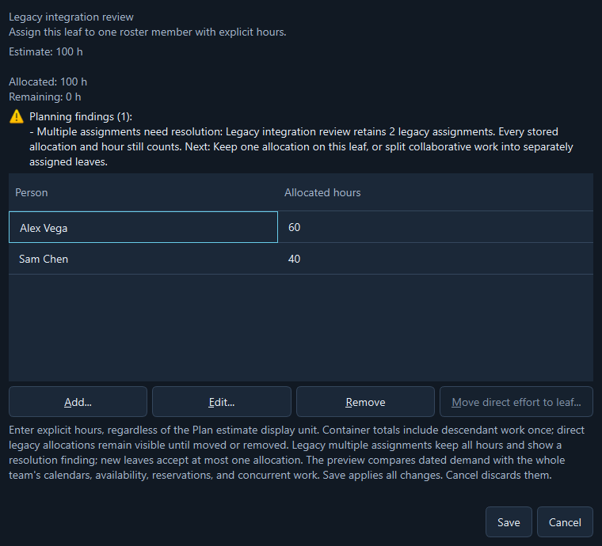
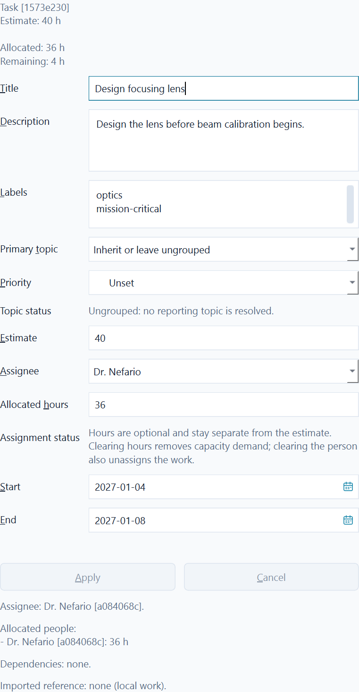
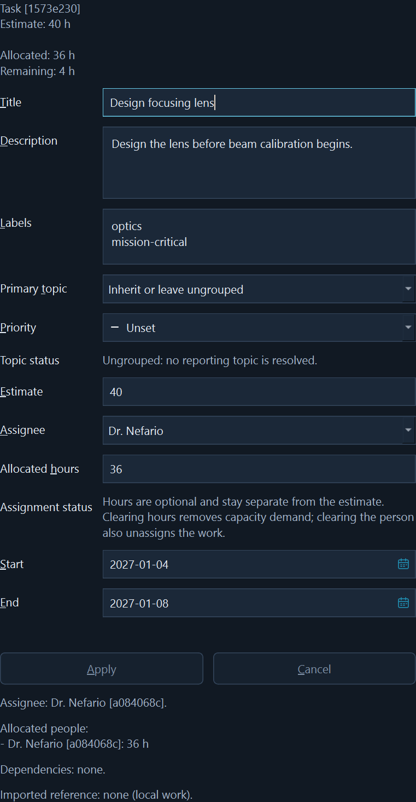

# Work allocations

This page describes implemented behavior. The first part of the
[single-person assignment decision](single-person-visual-planning.md) now limits
new executable leaf work to zero or one Allocation. Legacy plans keep all of
their assignments and exact hours until the user resolves them. The dedicated
consolidation workflow and compact one-person editor are both available.

An `Allocation` is an explicit link between one WorkItem and one Person, with
its own UUID and finite, non-negative Decimal hours. It is separate from work
ownership, Jira assignees, and personal availability. New leaf work accepts one
such link, including a zero-hour drafting entry. Represent collaboration with a
parent and separately assigned leaves instead of several people on one leaf.

The v0.4 calculation foundation in [#70](https://github.com/tidus747/planacity/issues/70)
provides `domain.allocation.Allocation` and the pure
`planning.allocations.validate_allocations` / `summarize_allocations` functions.
Pass a ProgramPlan and an immutable tuple of candidate allocations. References
must exist in the plan. Allocation IDs and work/person pairs must be unique;
edit an existing allocation instead of adding another entry for the same pair.
The transition policy also rejects a second allocation on a compliant leaf.

The summary returns all work and people in canonical plan/roster order. It sums
each explicit allocation ID once. For each work item:

- A leaf uses its entered estimate. A container's effective estimate is the exact
  recursive sum of descendant leaves; its entered estimate remains reference data.
- `known_estimate_hours` and `missing_estimate_count` distinguish a partial
  subtotal from a complete zero. A complete `estimate_hours` is available only
  when every leaf estimate is known.
- `direct_allocated_hours`, `descendant_allocated_hours`, and `allocated_hours`
  explain the exact subtree total without duplicating an allocation ID.
- `remaining_hours` is the complete effective estimate minus the subtree's
  allocated hours. It is unknown when estimates are missing or the container has
  unresolved direct allocations. A negative value identifies excess allocation.
- `unassigned` means no positive effort has been allocated. A zero-hour entry is
  retained as explicit data but does not make work positively allocated.

Partial allocation, allocation beyond an estimate, and work without an estimate
are allowed so incomplete plans remain visible. The calculation never changes
estimates, rescales allocations, assigns imported users, or rewrites baselines.
Decimal totals retain all input precision even under a low caller precision.

Existing plans may contain entered estimates or allocations on containers. The
estimate is shown separately as reference and is not added to leaf effort. Direct
container allocations stay visible and count once, but make the summary incomplete;
direct and descendant allocations together are marked mixed-level effort. Use
**Move direct effort to leaf...** to create a named child, clear the container's
entered estimate, and move its direct allocations while preserving their IDs and
hours. No dates, groups, relationships, or imported baselines move with them.

Existing plans may also contain several people on one leaf. Those entries remain
loadable, saveable, editable, and fully included in capacity. A calculated
**Multiple assignments need resolution** finding identifies the leaf, people,
and allocation IDs. Adding another entry is rejected, while editing an existing
entry or removing entries for incremental repair remains possible. Moving legacy
container effort to a leaf preserves every allocation and then shows the same
finding.

Choose **Consolidate legacy...** to select one of the leaf's existing Allocations
as the survivor. The preview keeps that ID and person, sums all direct hours
exactly, lists every removed Allocation ID, and compares whole-plan person loads
and relevant findings before and after. The button stays disabled until an
explicit survivor is selected. **Consolidate** updates only the allocation draft;
the outer **Save** applies it once. Cancel at either level preserves the original
plan. Estimates, dates, dependencies, hierarchy, WorkGroups, priorities, and Jira
baselines are not changed.

Consolidation is a repair for cases where one person should own all of the combined
hours. It is not the recommended representation of real collaboration: moving
Sam's hours onto Alex would attribute all capacity demand to Alex. If several
people contribute, cancel and split or duplicate the work into separately assigned
Tasks or Subtasks. That keeps each executable item's capacity and single Jira
assignee accurate while the parent Epic shows their combined effort.

The transitional finding with fictional legacy data in both appearances:

New allocations target leaf work. Adding or moving the first child under an
allocated leaf previews the same transfer and requires an explicit choice; Cancel
preserves the original plan. Dates outside the horizon do not discard allocations.
No date distribution, capacity comparison, or productivity measure is implied.

## Edit allocations in Plan

Select a work item, then choose **Work allocations...** in Selected work.
For a Task or Subtask leaf, choose one assignee and optionally enter explicit
allocated hours. Blank hours means owner only and creates no capacity demand.
Choosing **Unassigned** also removes that leaf's sole Allocation as an explicit
part of the draft. Reassigning a leaf preserves its Allocation ID and hours unless
the hours field is edited. Hours remain hours even when Plan displays estimates
in days or weeks; they are never copied from or synchronized with the estimate.

An Epic exposes one feature owner and no hours because Epic ownership does not
create capacity demand. A non-Epic container shows the distinct contributor team
and exact rolled-up hours as read-only context; edit its leaves separately.
Legacy multiple assignments keep every row and the Edit, Remove, and
**Consolidate legacy...** repair actions until the conflict is resolved.

The same compact fields are part of the transactional Selected work inspector.
**Apply** commits assignment and work-detail edits together once. **Cancel** restores
the complete draft. In **Work allocations...**, **Save** applies the preview once;
Cancel or Escape discards it. Use Tab/Shift+Tab, arrow keys in the person selector,
and the visible mnemonics without requiring a mouse.

The summary reports effective estimate, entered reference, direct and descendant
allocation, and remaining effort. Missing estimates, mixed levels, and excess
allocation remain visible. The findings preview also distributes dated demand
through the shared capacity engine and compares it with every concurrent
allocation, calendar, availability entry, and reservation in the candidate plan.
Findings are advisory: Save keeps an infeasible or incomplete draft visible for
later correction instead of silently changing or rejecting its hours.

Deletion of a person or work item previews affected allocations and requires
confirmation. Person deletion also identifies canonical assignee references.
Deleting a parent includes hidden descendants. Surviving allocation IDs remain
stable. Jira imports never create allocations automatically, and allocation edits
do not change imported baselines or Jira CSV effort units.

ProgramPlan stores allocations, introduced in schema 7, in current schema 11
SQLite projects and JSON backups.
Schemas 1-6 load with an empty collection. Keep an original backup or use Save As
if an older build must still open the project.

The same assignment in the complete Plan inspector draft:

The same overload finding from all concurrent work remains readable in the
allocation draft in both appearances: [light](images/planning-findings-light.png)
and [dark](images/planning-findings-dark.png).

For a quick evaluation, assign one person and 100 hours to a leaf, save and reopen,
then reassign the entry and cancel. Check that its ID and hours remain unchanged.
Open an older multi-person plan to verify that every entry still counts and the
resolution finding appears without rewriting the file.
The shared dated capacity engine now consumes explicit allocations without
changing their hierarchy or storage. It spreads each person's hours across the
WorkItem's complete dates using positive planning capacity after reservations,
then sums concurrent work and retains negative remaining capacity. Missing dates,
calendars, or positive-capacity days keep the hours as explicit unplaced demand.

Canonical Jira-aligned ownership and compact editing now complete the S03
foundation. The [roadmap](roadmap.md) continues with the demonstration dataset and
v0.5 visual planning. See the
[planning decisions](planning-decisions.md) for the dated distribution contract.
