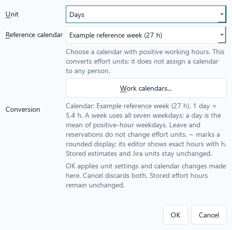
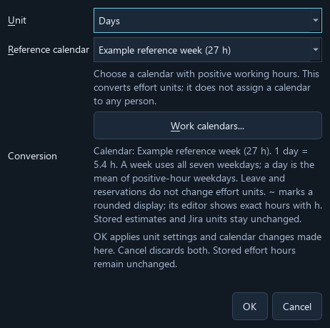

# Estimate units

Choose **Planning -> Estimate units...** to enter and display Plan estimates in
Hours, Days, or Weeks. This preference belongs to the plan and is saved with it.
Hours is the default for new plans and files from schemas 1-5.

Days and Weeks require an explicit reference calendar. Create one in
**People -> Work calendars...**, then select it in the estimate-units dialog.
The preview explains the conversion before you confirm. No 8-hour day, 40-hour
week, or individual person's calendar is assumed.

- One week is the sum of the reference calendar's seven weekday hour values.
- One day is that total divided by the number of weekdays with positive hours.
  This is an average working-day equivalent when daily hours vary.
- Leave, reservations, assignments, and the planning horizon do not change these
  effort equivalents. They are not elapsed durations and do not schedule dates.

For example, a calendar with four 6-hour days and one 3-hour day defines a
27-hour week and a 5.4-hour day. A 27-hour estimate displays as 5 days or 1 week.
Entering 1.25 days stores exactly 6.75 hours. The Plan column header identifies
the active unit, and its tooltip shows the stored hours and conversion rule.

Changing the unit changes only the preference. Changing its reference calendar
changes displayed equivalents and subsequent entry conversions, while existing
hour estimates remain unchanged. The calendar editor explains this effect.
Choose another reference or switch to Hours before deleting a referenced
calendar. A calendar with no working hours cannot define estimate units.

## Precision and editing

Canonical estimates remain exact Decimal hours. Conversions use exact rational
arithmetic rather than floats. Blank means unknown; zero is an explicit estimate.
Negative or non-finite values are rejected.

Some hour values cannot be displayed as a terminating decimal in days or weeks.
Those display values begin with `~` and use 16 significant digits. Opening the
cell editor then shows its exact hours with an `h` suffix. Pressing Enter without
changing that value preserves the original estimate, including its precision.
You may enter explicit hours, such as `1.5 h`, regardless of the selected unit.

If an entered day/week value would produce non-terminating hour decimals, the
editor asks for exact hours instead of silently rounding the stored estimate.
For example, a 22-hour, three-day calendar makes 1 day equal to 22/3 hours;
3 days can be stored exactly, while 1 day requires an explicit hour estimate.

Jira import previews, mapping profiles, Changes, and CSV exports retain their
explicit hours/seconds conventions. They are independent of this display
preference, and imported baseline estimates are never rewritten.

Saving writes schema 7. Keep a backup or use Save As when an older build must
still open the original file. See [the file format](project-file-format.md).

## Set up calendars without leaving the dialog

The reference selector is disabled in Hours because no conversion is required.
Select Days or Weeks, then choose an existing calendar. If the list is empty,
choose **Work calendars...** directly in this dialog to add one. Closing the
calendar manager refreshes the choices and preserves your selected unit and
reference calendar when it still exists. Choose the new calendar explicitly.

Calendars with no positive hours are labelled **(no working hours)** and cannot
be used for Days/Weeks. Edit their hours or choose another calendar. This
reference controls effort conversion only; people retain their own assignments.

Calendar changes made through this dialog are drafts. **OK** applies both calendar
and unit changes; **Cancel** discards both, including newly added calendars.
This differs from opening the calendar manager directly from People, where
confirming an individual calendar form applies its changes immediately. Existing
reference-calendar deletion safeguards still apply: confirm another reference
or Hours first, then reopen the manager to delete the old calendar.

