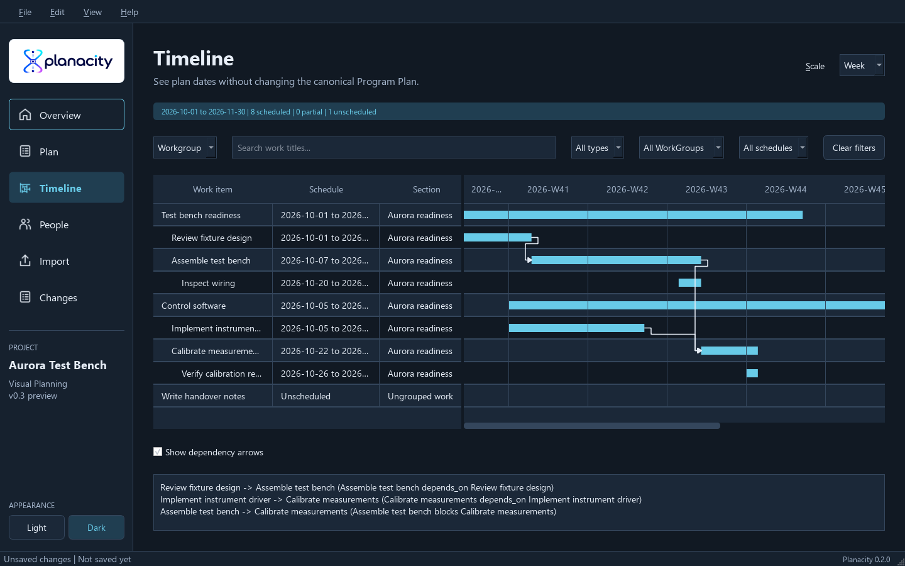
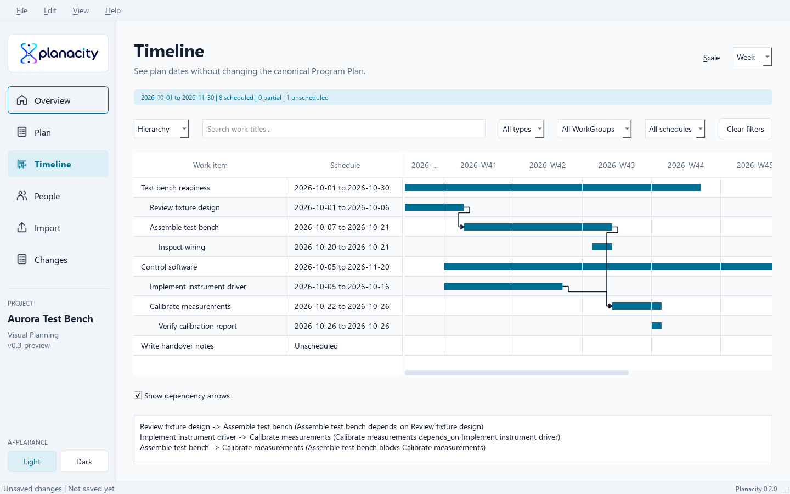
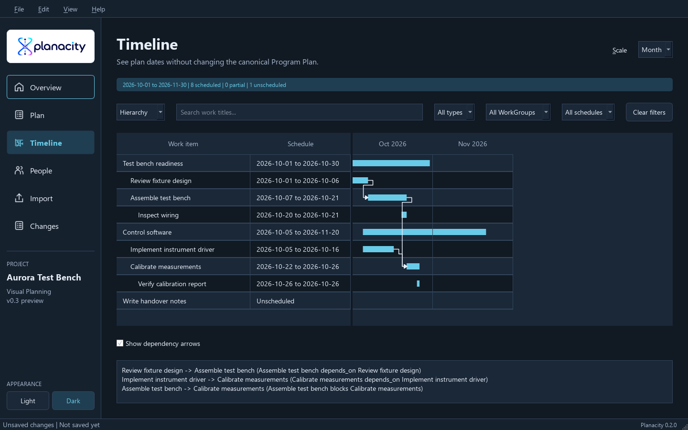
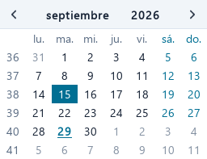
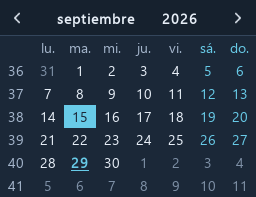
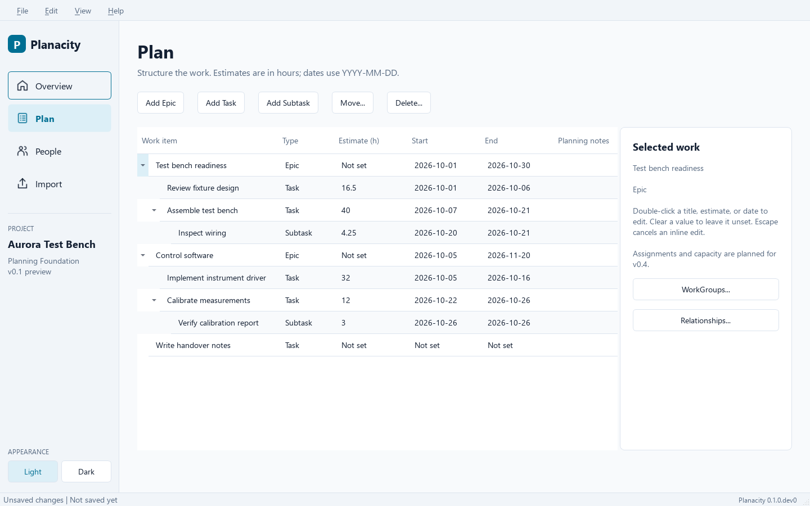
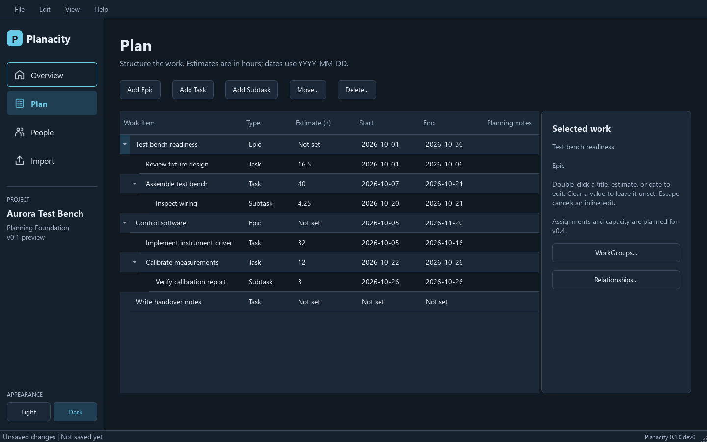

# Create, edit, save, and reopen a plan

Install and run from source using [the README](../README.md#run-from-source).
No account or network connection is needed while planning.

1. Choose **File -> New plan...** (`Ctrl+N`). Enter a name and choose an inclusive
   date range from the calendar controls. You can also type dates in `YYYY-MM-DD`
   form. Calendar controls follow the selected light or dark appearance. A plan
   can span any dates, not only a quarter.
2. Open **Plan**. Add an Epic, select it and add a Task, then select that Task and
   add a Subtask. With no Epic selected, Add Task creates a standalone Task.
3. Double-click a title, estimate, start, or end cell, or press `F2` to edit.
   Estimates use hours, including fractional hours. Clear a value to leave it
   unset; zero hours is different from unknown. Invalid drafts stay editable;
   correct them or press `Escape` to cancel.
4. Use **Move...** to select a different parent. **Delete...** previews the number
   of work items, relationships, and memberships being removed before confirming.
5. Use **WorkGroups...** to organize Epics independently from hierarchy. Use
   **Relationships...** to add `related_to`, `depends_on`, or `blocks` links.
   Links do not automatically reschedule work. Dates outside the horizon are
   retained and shown in the Planning notes column.
6. Open **People** to add, rename, or remove roster members. Assignments, load
   calculations, and recurring capacity reservations are planned for v0.4.
7. Open **Timeline** (`Ctrl+3`) for a read-only view of scheduled bars across the
   planning horizon. Start-only, end-only, unscheduled, and outside-horizon work
   remain visible as explicit schedule states. Timeline selection and scrolling
   do not change the plan.
   Use **Scale** to choose Day, Week, or Month. Weeks start on Monday and use ISO
   week numbers; months follow the calendar, including leap days. Partial periods
   at the horizon edges are clipped, with exact dates in header tooltips.
   The selected work and visible date context are preserved where scrolling allows.
   The scale is remembered locally and never changes dates, hours, or project data.
   Use `Alt+S` to focus Scale, then arrow keys to choose a value.
8. Choose **File -> Save** (`Ctrl+S`) and select a `.planacity` path. **Save As**
   (`Ctrl+Shift+S`) saves a separate project. The window title shows `*` while
   changes are unsaved. Cancelled or failed saves retain the current draft.
9. Close Planacity, launch it again, then use **File -> Open...** (`Ctrl+O`) to
   reopen the project. Continue editing and save again.

New, Open, Restore, and Exit ask whether to save, discard, or cancel when the
current plan has unsaved changes. **File -> Plan properties...** edits the name,
description, and horizon. Both appearances remain available from the sidebar and
**View -> Appearance**; this preference is stored separately from project data.

## Try the fictional example

Use **File -> Restore JSON backup...** and choose
`examples/aurora.planacity.json`. It opens as an unsaved copy, preserving the sample
file. Save it to a new `.planacity` path. The sample contains two Epics, Tasks and
Subtasks, three people, hour estimates, dates, a WorkGroup, and dependencies.
Missing estimates/dates are intentional examples of incomplete planning data.

Use **File -> Export JSON backup...** for a portable backup. See
[project-file-format.md](project-file-format.md) for validation and recovery.

## Validation record

### Grouping, filters, and dependencies

In Timeline, use the grouping selector to choose Hierarchy, Epic, or WorkGroup.
The Section column identifies grouped work, including Standalone work and
Ungrouped work. An Epic in several WorkGroups appears in each group; the summary
counts each work item once. Sibling order and canonical work identities stay intact.

Combine title search, work type, WorkGroup, and schedule-state filters. Filters
match individual rows, so matching children can appear without their parents.
**Clear filters** restores all work in the current grouping. These controls can
be reached with Tab and operated using the keyboard.

**Show dependency arrows** connects predecessor ends to successor starts:
`A depends_on B` draws `B -> A`; `A blocks B` draws `A -> B`. Hierarchy and
`related_to` links do not create dependency arrows. Select work to read its links
in the keyboard-accessible details panel. Overlapping dates are explained there.

Cyclic, filtered, partially scheduled, or outside-horizon endpoints have an
explanation instead of an arrow. Both endpoints must also be on screen; scroll
or choose a broader scale to see the connector. Multiple memberships show links
within shared sections; links across sections use the first occurrences.
Toggle arrows off to reduce visual clutter. No dates, estimates, relationships,
or imported baselines are changed by these views.

Timeline scales retain selection and date context without editing the plan.
Week and month views are available in both appearances; narrow period labels
are shortened, with exact dates available in header tooltips.

Date pickers use compact calendar cells so date numbers and weekday headers fit
in both appearances. Mouse selection and keyboard date entry remain available.

For the v0.2 workflow, see [Jira CSV import](jira-import.md) and
[Jira CSV export](jira-export.md). Imported baselines survive local edits and
save/reopen; use Changes (Ctrl+6) to review differences.

On Windows, Python 3.12 and PySide6 6.11.2, automated tests exercise new-plan
validation, hierarchy editing, invalid inline drafts, People/WorkGroup/link forms,
Ctrl+S, Save As, cancellation, close/reopen/continue, and JSON backup/restore.
The GUI acceptance tests also pass with Qt's native `windows` platform plugin,
in addition to the offscreen CI tests. Both appearances were visually inspected
using the fictional example; screenshots are included below.

This is a source preview, not a packaged release. Installer and broader usability
testing remain release work. No release tag or application download is published.

