# Create, edit, save, and reopen a plan

Install and run from source using [the README](../README.md#run-from-source).
No account or network connection is needed while planning.

1. Choose **File -> New plan...** (`Ctrl+N`). Enter a name and choose an inclusive
   date range from the calendar controls. You can also type dates in `YYYY-MM-DD`
   form. Calendar controls follow the selected light or dark appearance. A plan
   can span any dates, not only a quarter.
2. Open **Plan**. Add an Epic, select it and add a Task, then select that Task and
   add a Subtask. With no Epic selected, Add Task creates a standalone Task.
3. Double-click a title, priority, estimate, start, or end cell, or press `F2`
   to edit.
   Estimates default to hours, including fractional hours. Choose days or weeks
   in **Planning -> Estimate units...** with an explicit reference calendar.
   See [estimate units](estimate-units.md) for conversions. Clear a value to leave it
   unset; zero hours is different from unknown. Invalid drafts stay editable;
   correct them or press `Escape` to cancel. Epic and Task containers show
   read-only totals from their leaves. Their tooltips retain any entered or
   imported container estimate as reference and identify missing leaf estimates.
   The inspector beside the table edits title, description, ordered labels,
   primary reporting topic, priority, dates, and leaf estimate together. Choose
   **Apply** to commit the complete draft or **Cancel** to restore its saved values.
4. Use **Move...** to select a different parent. **Delete...** previews the number
   of work items, relationships, and memberships being removed before confirming.
5. Use **WorkGroups...** to organize Epics independently from hierarchy. Use
   **Relationships...** to add `related_to`, `depends_on`, or `blocks` links.
   New dependency cycles and fully dated conflicts are rejected with the permitted
   date boundary. Partial dependencies remain unevaluated until both required
   dates exist. Links never automatically reschedule work. Dates outside the
   horizon are retained and shown in the Planning notes column.
6. Open **People** to add, rename, or remove roster members. Use **Work calendars...**
   to define all seven weekdays, then **Assign calendar...** for each person.
   Use **Availability...** to enter dated unavailable shares and preview overlaps.
   Set an inclusive capacity range with the Day, Week, Plan horizon, or custom
   controls. The roster shows nominal and available hours, named reservations,
   planning capacity, dated allocated work, signed remaining hours, and demand
   that cannot yet be placed. Unassigned calendars show Unknown rather than free
   time. The WorkGroup column and filter use positive allocations across the
   whole plan; filtering people never removes competing work from their capacity
   totals. Select a person to compare additive reporting topics, associated work,
   whole-plan allocated hours, selected-range scheduled hours, and unplaced
   demand. Then choose a day, week, or selected-period detail scale to see the
   duties and tasks consuming that range. Source actions reopen the matching
   reservation or work-allocation editor.
   See [calendar and availability setup](capacity-model.md).
   Choose **Reserve capacity...** here or from the **Planning** menu for recurring
   meetings or other duties. Enter hours per person, review sprint proration and
   remaining hours, then Confirm. Select an existing rule to edit or preview its
   deletion. See the [wizard guide](capacity-wizards.md). Program events remain
   future work; saved work allocations are included in People capacity.
7. Open **Timeline** (`Ctrl+3`) for a view of scheduled bars across the
   planning horizon. Start-only, end-only, unscheduled, and outside-horizon work
   remain visible as explicit schedule states. Timeline selection and scrolling
   do not change the plan.
   Use **Scale** to choose Day, Week, or Month. Weeks start on Monday and use ISO
   week numbers; months follow the calendar, including leap days. Partial periods
   at the horizon edges are clipped, with exact dates in header tooltips.
   The selected work and visible date context are preserved where scrolling allows.
   The scale is remembered locally and never changes dates, hours, or project data.
   Use `Alt+S` to focus Scale, then arrow keys to choose a value.
8. Choose **File -> Save** (`Ctrl+S`) and select a `.planacity` path. **Save As**
   (`Ctrl+Shift+S`) saves a separate project. The window title shows `*` while
   changes are unsaved. Cancelled or failed saves retain the current draft.
9. Close Planacity, launch it again, then use **File -> Open...** (`Ctrl+O`) to
   reopen the project. Continue editing and save again.

New, Open, Restore, and Exit ask whether to save, discard, or cancel when the
current plan has unsaved changes. **File -> Plan properties...** edits the name,
description, and horizon. Both appearances remain available from the sidebar and
**View -> Appearance**; this preference is stored separately from project data.

## Explain People WorkGroups

People associations are calculated from positive work allocations and effective
WorkGroup context. They are not manually maintained team memberships. One person
keeps one roster row even when their work spans several groups. Zero-hour
allocations do not create an association, and people with no positive allocation
remain visible as **No assigned work**.

Use the **WorkGroup** filter to focus the roster. **Ungrouped** and **Ambiguous
group** remain available when current work cannot resolve to one reporting topic.
The selected-person table uses the single primary reporting topic for additive
hours while listing all inherited and override groups as context. Whole-plan
allocated hours are intentionally separate from work scheduled or left unplaced
inside the selected date range. The capacity columns always retain the complete
competing workload, even while the roster is filtered.

Actual People WorkGroups in both appearances:

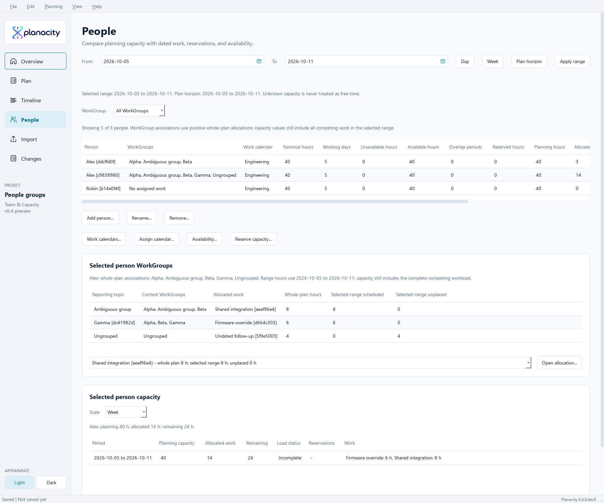
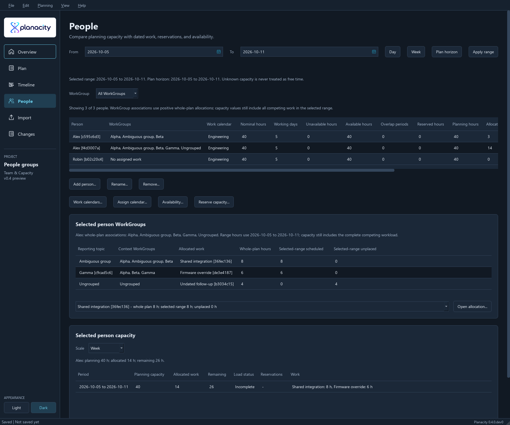

## Filter the Plan

Combine title search, work type, WorkGroup, priority, and schedule state above
the Plan table. Title search ignores case and leading or trailing spaces.
WorkGroup membership includes descendants of its Epics. Priority includes an
explicit Unset choice.
The summary distinguishes actual matches from ancestors retained for context.
Matching branches expand automatically; canonical sibling order stays unchanged.

Context ancestors use italic text and show **Context only** in Planning notes.
Their cells are read-only until they match the filters. Select them to add or
move children, or clear the filters before editing their cells. **Delete...**
always previews the full subtree, including the number of hidden work items.

Use `Tab` to navigate filters and arrow keys in the choices. **Clear filters**
restores all work. `F2`, `Enter`, and `Escape` retain the usual editing behavior.
Invalid drafts must be corrected or cancelled before changing filters. A valid
edit that stops matching hides the row and clears its selection. Added or moved
work that becomes hidden gets an explicit message; clear filters to find it.

Filters do not change dates, estimates, relationships, imported baselines, or the
saved project. They are temporary view choices and reset when another plan opens.
If a selected WorkGroup is removed, that filter returns to All WorkGroups.
Plan and Timeline keep independent filter selections.

Actual Plan filters in both appearances:

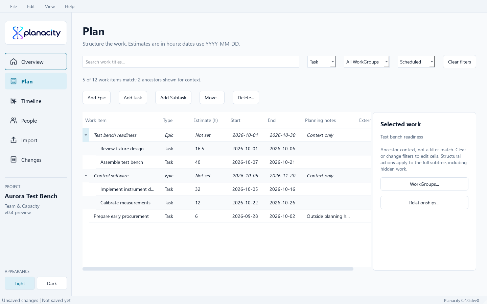
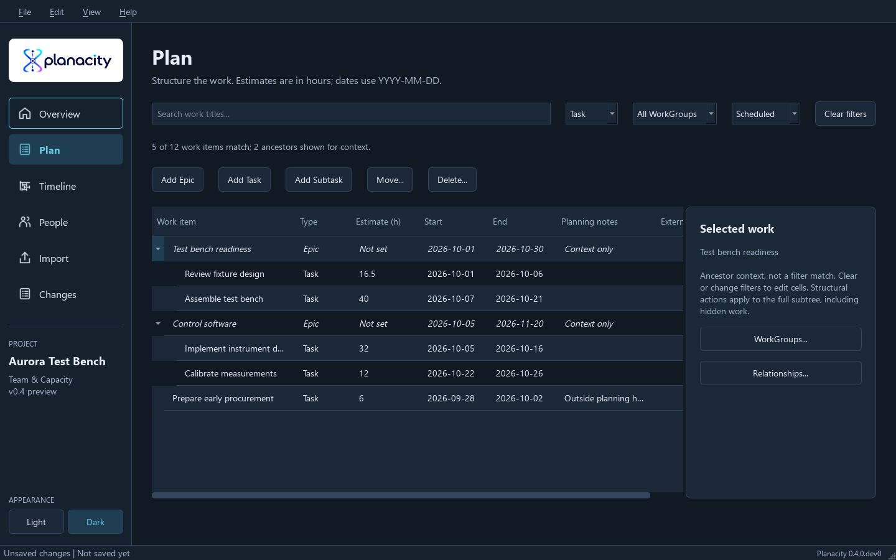

## Prioritize work explicitly

Priority is optional. The ordered values are Highest, High, Medium, Low, and
Lowest; Unset is separate and never means Medium. Double-click the Priority cell
or select it and press `F2`, then choose a value with the arrow keys and press
`Enter`. The inspector offers the same field as part of its complete Apply/Cancel
draft. Distinct arrow and line icons accompany the text, so meaning does not
depend on color.

Choose **Priority: Highest first** in the sort control to order siblings within
each hierarchy level. Equal priorities retain canonical plan order and Unset is
last. Choose **Plan order** to restore the saved sibling order. Filtering and
sorting preserve selection by stable work ID and never rewrite hierarchy.

Priority is a planning decision only. It does not change dates, estimates,
allocations, capacity, dependencies, or criticality, and it is not inherited by
children. Existing schema 1-8 projects open with priority Unset.

Actual priority editing and ordering in both appearances:

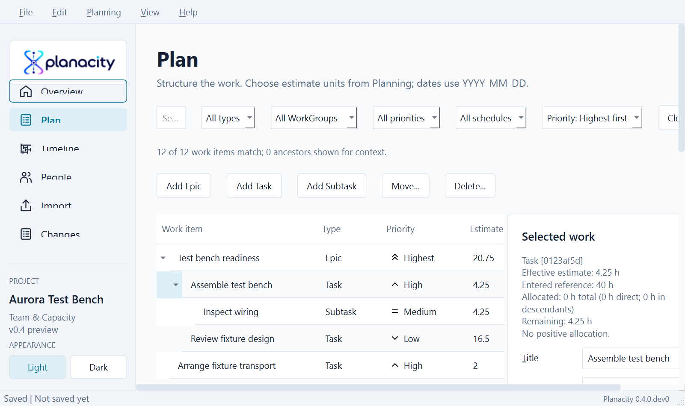
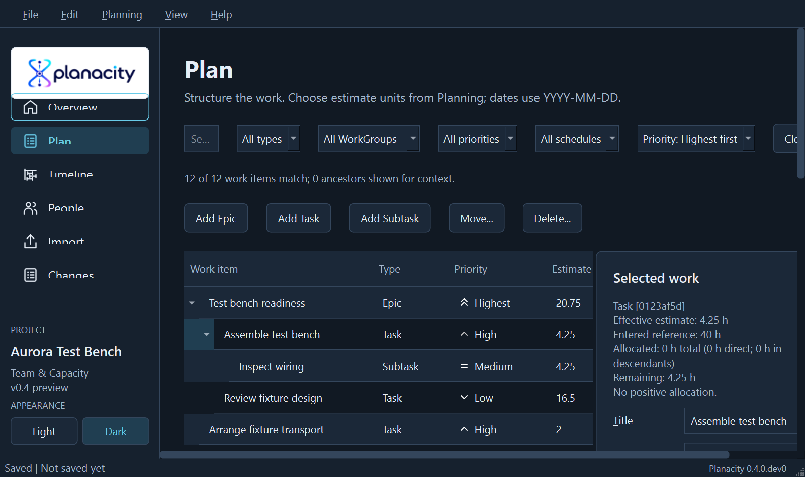

## Map Jira priorities without guessing

On the first Jira import page, map the optional Priority CSV column. The next
page lists every distinct nonblank value. Exact default names receive a visible
suggestion; custom labels stay **Unmapped -> Unset** until you choose a canonical
level. The review page shows source and Planacity values side by side, including
the unresolved state. Save a version 2 mapping profile to reuse those choices.

During export, set one explicit target label for each canonical level and review
the per-row priority and assignee result. Unchanged imported work keeps its exact
original priority and external assignee text. Edited or new priorities use the
target label. Changed or new assignees require an explicit Jira identity for the
selected roster person; Planacity never exports a display name by assumption.
Unresolved priority source values remain visible and preserved, while a genuine
Unset value exports blank. Duplicate target labels or missing required identities
disable export instead of creating an ambiguous CSV. Save or load an export
profile to reuse headers, units, delimiter, date format, and target labels;
person identities are not stored in that profile.

Actual Jira priority mapping in both appearances:

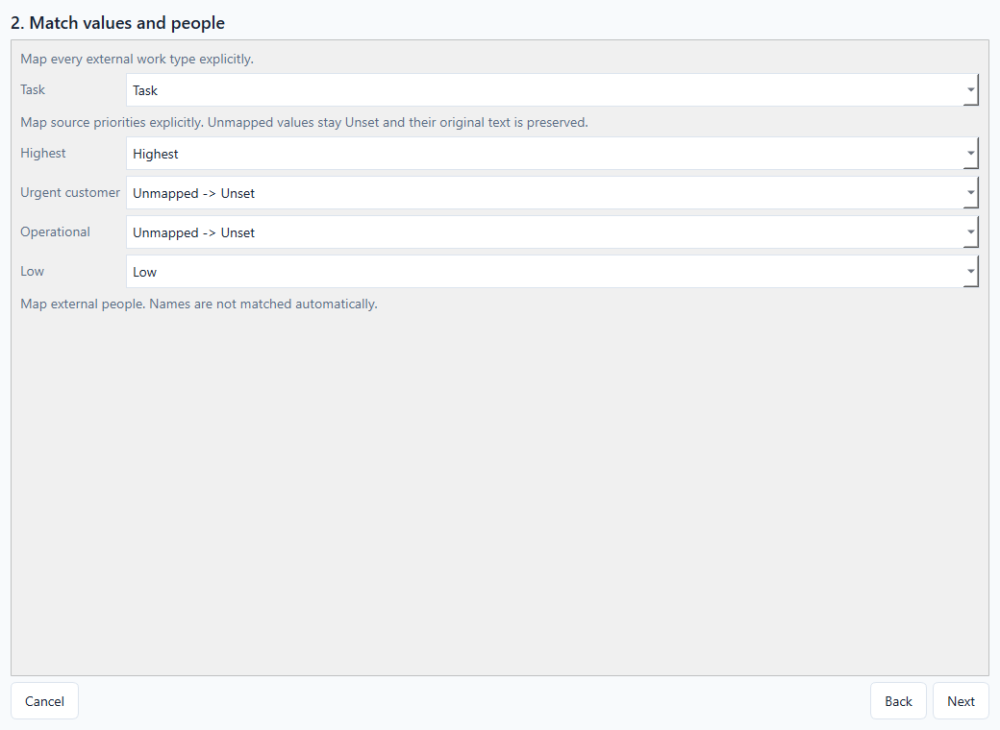
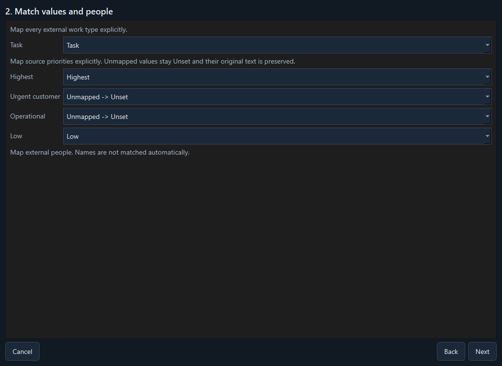

## Edit complete work details

Select a matching Plan row to open its inspector. Labels use one non-blank value
per line and retain their displayed order. Primary topic and priority can be
selected without changing the WorkGroup hierarchy. Leaf estimates follow the
current Hours, Days, or Weeks preference; container effort is derived and
read-only. Calendar buttons and exact `YYYY-MM-DD` entry use the same date rules
as the Plan table.

Allocated people and hours, planning findings, dependencies, stable short IDs,
and imported reference values are context only. Imported baseline values are
never changed by inspector edits. Ancestors shown only to explain a filtered
match are also read-only until the filters are changed or cleared.

**Apply** validates the whole draft and makes one plan change. An invalid field
leaves every saved value unchanged and keeps the draft available for correction.
**Cancel** discards all inspector edits. Selecting another row, changing filters,
leaving Plan, or starting a file action while a draft exists offers
Save/Discard/Cancel. A no-op draft does not mark the project as changed.

Actual work inspector in both appearances:

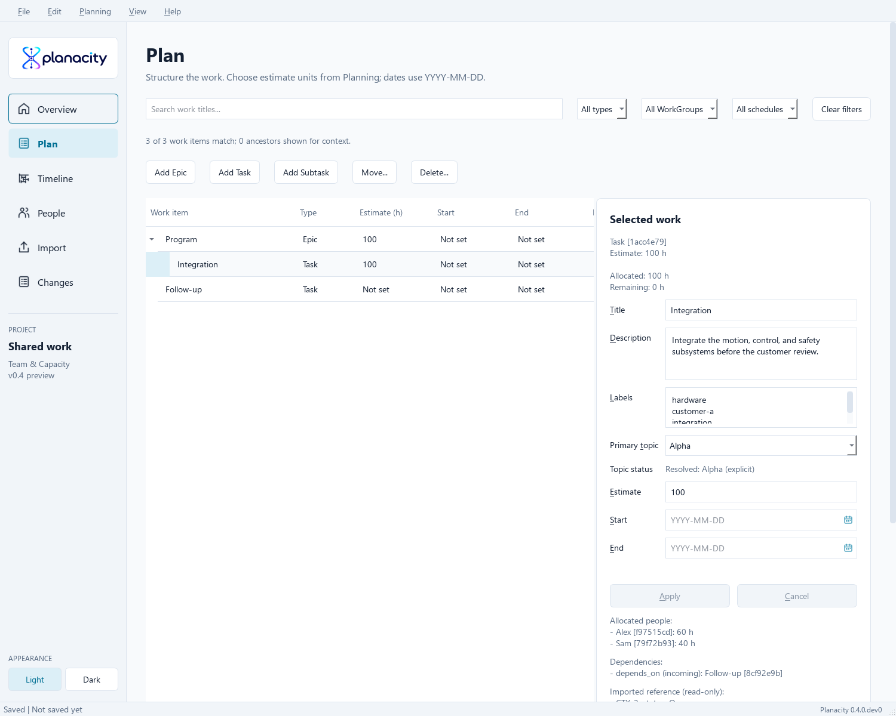
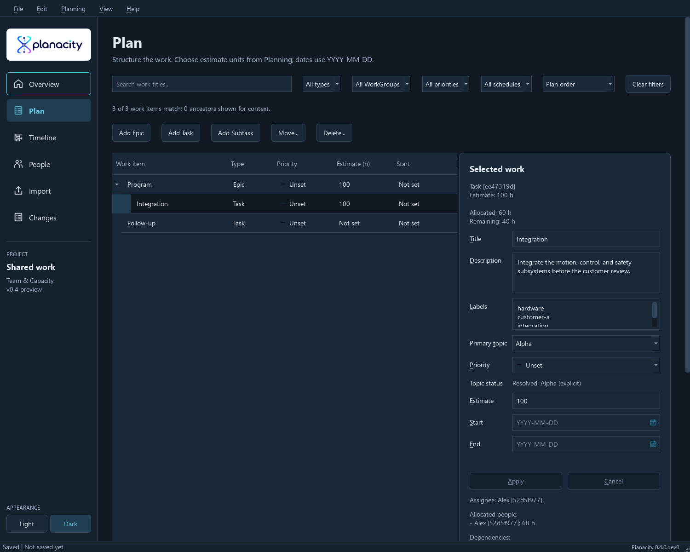

## Review the Program overview

Open **Overview** and expand **Analysis** to inspect the complete inclusive plan
horizon. This scope is fixed and is not changed by temporary Plan or Timeline
filters. Use the analysis selector to compare:

- **Capacity by person**: planning capacity, scheduled work, signed remaining
  hours, unplaced demand, and the resulting state for every roster member.
- **Planned work by topic**: either scheduled allocation hours inside the
  horizon or estimated leaf effort across the whole current plan. Work with no
  reporting topic stays in Ungrouped; conflicting inherited topics stay in
  Ambiguous.
- **Capacity breakdown**: nominal time, recorded unavailability, available time,
  each named reservation rule, planning capacity, scheduled work, remaining
  time, and unplaced demand.

Solid bars show known values, dashed outlines show the comparison capacity, and
hatching or dotted marks identify overload or incomplete inputs. The table below
each chart is its exact keyboard-accessible equivalent. Coverage notes identify
missing calendars, dates, estimates, or assignments instead of silently treating
them as free capacity. Overview is read-only; use Plan or People to correct an
input.

Actual Overview analysis in both appearances:

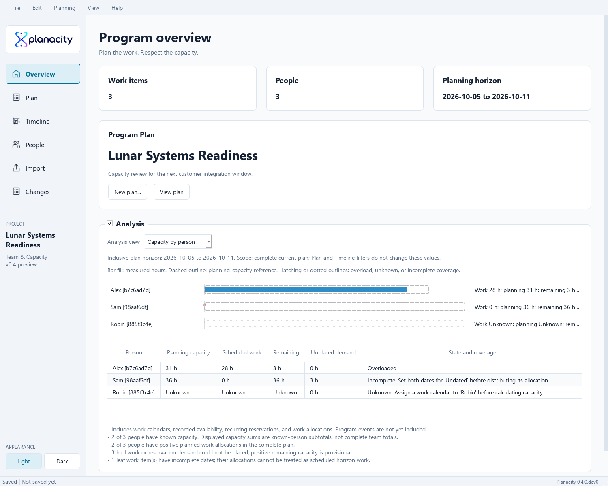
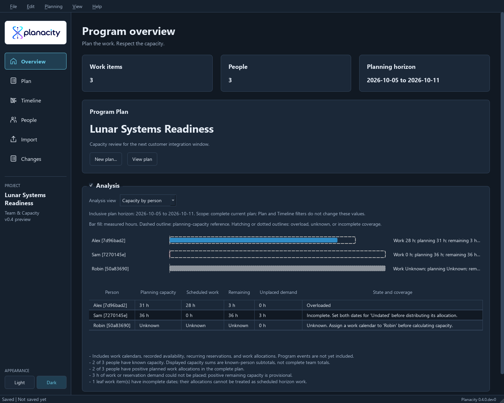

## Try the complete fictional example

Use **File -> Restore JSON backup...** and choose
`examples/moon-heist.planacity.json`. It opens as an unsaved copy, preserving the
sample file. Save it to a new `.planacity` path. The complete v0.4 baseline has
four WorkGroups and Epics, fourteen separately owned leaves, five people, two
calendar patterns, an absence, recurring duties, priorities, descriptions, and a
valid fork/join dependency network. Its 236 h of dated work is feasible against
1,048 h of planning capacity with no initial findings.

The [Moon Heist walkthrough](moon-heist-example.md) records the exact per-person
and per-topic totals and provides repeatable exercises for overload, unknown
inputs, dependency guards, persistence, and Jira baseline preservation.

Use `examples/aurora.planacity.json` for the unchanged schema 1 migration sample.
Aurora intentionally includes incomplete and outside-horizon work. Its
[Visual Planning walkthrough](../examples/README.md#visual-planning-walkthrough)
covers partial dates, grouping, dependency arrows, resizing, and saving a new
project. The [v0.3 validation record](v0.3-validation.md) records the checks for
that source preview.

Use **File -> Export JSON backup...** for a portable backup. See
[project-file-format.md](project-file-format.md) for validation and recovery.

## Validation record

### Grouping, filters, and dependencies

In Timeline, use the grouping selector to choose Hierarchy, Epic, or WorkGroup.
The Section column identifies grouped work, including Standalone work and
Ungrouped work. An Epic in several WorkGroups appears in each group; the summary
counts each work item once. Sibling order and canonical work identities stay intact.

Combine title search, work type, WorkGroup, and schedule-state filters. Filters
match individual rows, so matching children can appear without their parents.
**Clear filters** restores all work in the current grouping. These controls can
be reached with Tab and operated using the keyboard.

**Show dependency arrows** connects predecessor ends to successor starts:
`A depends_on B` draws `B -> A`; `A blocks B` draws `A -> B`. Hierarchy and
`related_to` links do not create dependency arrows. Select work to read its links
in the keyboard-accessible details panel. Overlapping dates are explained there.

Cyclic, filtered, partially scheduled, or outside-horizon endpoints have an
explanation instead of an arrow. Both endpoints must also be on screen; scroll
or choose a broader scale to see the connector. Multiple memberships show links
within shared sections; links across sections use the first occurrences.
Toggle arrows off to reduce visual clutter. Grouping, filtering, and arrow display
do not change dates, estimates, relationships, or imported baselines.

### Read Timeline colors and shapes

Scheduled bars use the resolved primary WorkGroup as their color. The same group
keeps its palette position after sorting, filtering, renaming, reopening, or
adding another group. Use the named legend and WorkGroup text in item details as
the authority because two groups can share a palette color. Ungrouped work has a
neutral color; unresolved legacy membership appears as the patterned Ambiguous
group style instead of silently selecting one group.

Shape identifies the work type independently from color: Epics use a bracket
with end caps, Tasks use a rounded bar, and Subtasks use a slim bar. Selection,
dependency arrows, warnings, partial-date markers, and resize handles remain
separate cues. The legend and item tooltips expose equivalent text for keyboard
and assistive-technology use.

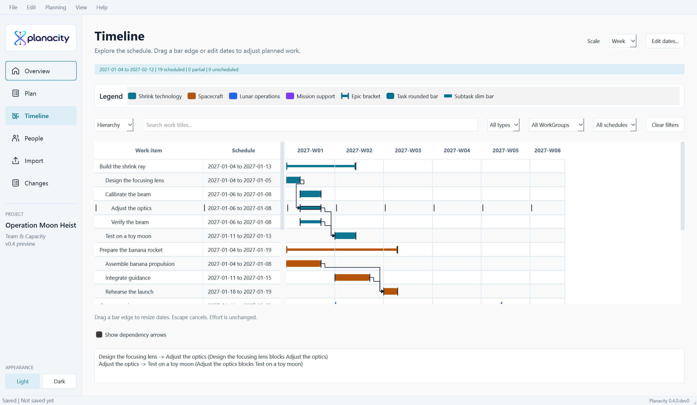
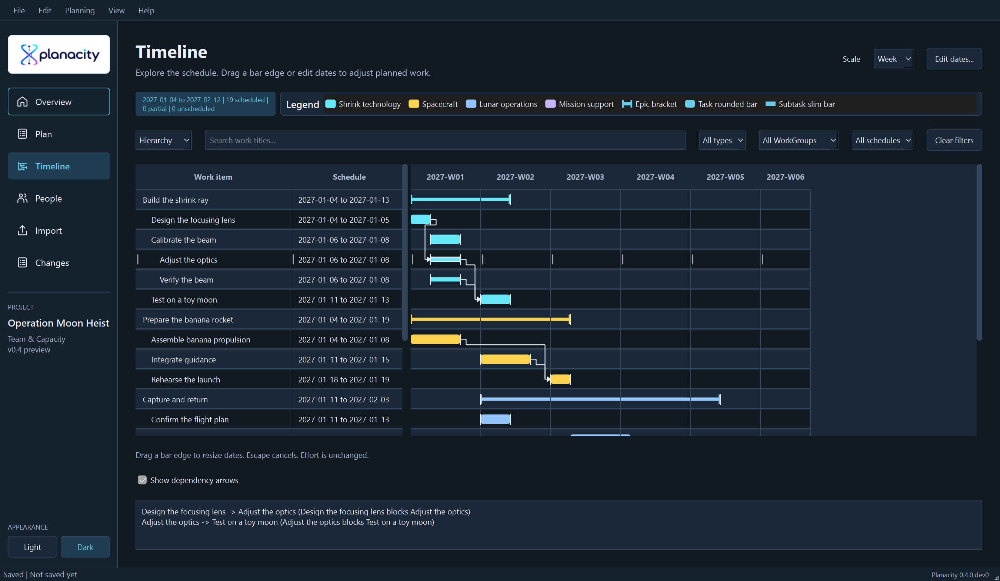

New cycles cannot be added. Cycles and conflicts already present in imported or
older plans remain visible for repair. With inclusive dates, a predecessor must
end at least one calendar day before its successor starts; a same-day boundary is
a one-day conflict.

### Adjust dates from Timeline

Drag the left or right handle of a fully scheduled bar. The dashed line snaps to
calendar days at every scale. The preview shows original and proposed dates and
inclusive calendar duration, which is separate from estimated effort hours.
Release inside the schedule to apply one validated change. A dependency-breaking
drop shows both affected work items and the latest/earliest permitted boundary.
Escape, a reversed date range, or a drop outside the schedule preserves the original dates.
Changing scale, filtering, leaving the view, or receiving a new plan cancels a drag.

Scroll horizontally before dragging to bring the required dates into view. The
view does not automatically pan when the pointer leaves the schedule, and retains
its scroll position after a valid resize. Only actual visible date edges have
handles; dates outside the horizon are never silently clamped.

Select work and choose **Edit dates...** (`Alt+D`) to enter dates with the keyboard
or calendar. Clear a field to leave it unset. This also works for partial and
unscheduled work or dates outside the displayed horizon. The Plan view continues
to offer the same keyboard date editing. Both editors check all incoming and
outgoing dependencies, including work hidden by filters. An old conflict may be
preserved or reduced so it can be repaired incrementally; increasing it is rejected.
Clearing a required date leaves an explicit unevaluated finding. Outside-horizon
warnings remain visible.

Date changes update Plan, Timeline, and Changes together and are included when
you save the project. Effort hours, dependencies, other work, and imported
baselines stay unchanged. Whole-bar moving and automatic scheduling remain future work.

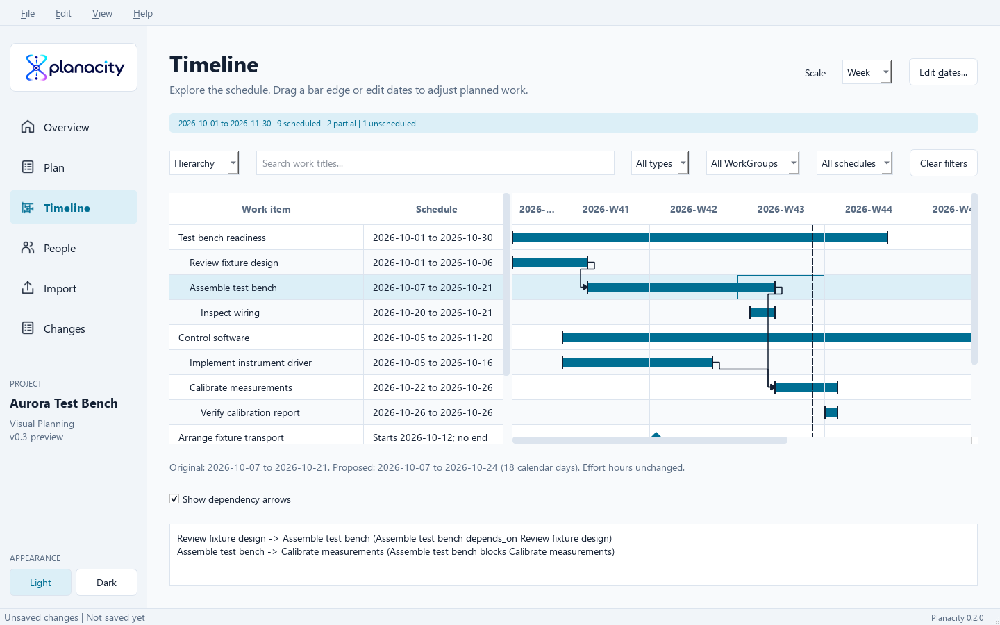
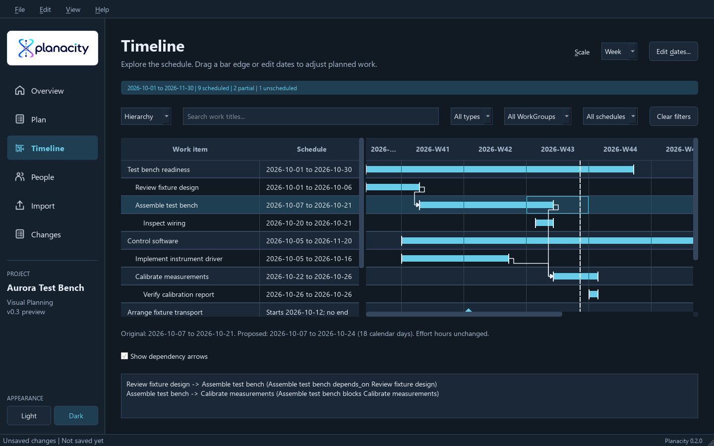

Timeline scales retain selection and date context without editing the plan.
Week and month views are available in both appearances; narrow period labels
are shortened, with exact dates available in header tooltips.

Date pickers use compact calendar cells so date numbers and weekday headers fit
in both appearances. Mouse selection and keyboard date entry remain available.

For the v0.2 workflow, see [Jira CSV import](jira-import.md) and
[Jira CSV export](jira-export.md). Imported baselines survive local edits and
save/reopen; use Changes (Ctrl+6) to review differences.

On Windows, Python 3.12 and PySide6 6.11.2, automated tests exercise new-plan
validation, hierarchy editing, invalid inline drafts, People/WorkGroup/link forms,
Ctrl+S, Save As, cancellation, close/reopen/continue, and JSON backup/restore.
The GUI acceptance tests also pass with Qt's native `windows` platform plugin,
in addition to the offscreen CI tests. Both appearances were visually inspected
using the fictional example; screenshots are included below.

This is a source preview, not a packaged release. Installer and broader usability
testing remain release work. No release tag or application download is published.

## Assign work to people

In Plan, select executable leaf work and choose **Work allocations...**. Add one
person from the roster with explicit hours, or edit, reassign, or remove the
existing assignment. Review the effective estimate, entered reference, allocated
hours, and remaining effort before Save. Container summaries separate direct and
descendant allocations. Represent collaborative work as a parent with separately
assigned leaves.

Legacy multi-person leaves keep every assignment and hour. They show **Multiple
assignments need resolution** and reject another entry. Choose **Consolidate
legacy...**, select the existing assignment to keep, and review its preserved ID,
the removed IDs, exact combined hours, person-load changes, and findings. Confirm
to update the draft, then Save once; Cancel at either level changes nothing.
Manual editing and incremental removal remain available. Legacy direct container
effort can be moved to a named leaf without changing allocation IDs or hours.
Allocation hours are independent of the estimate display unit. See the
[allocation guide](allocation-model.md) for screenshots and calculation limits.
