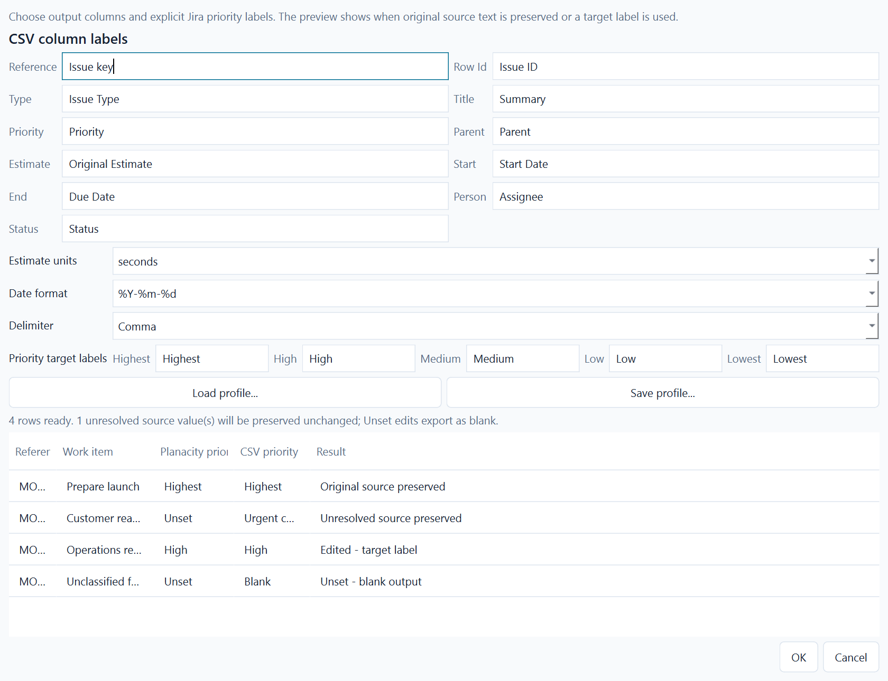
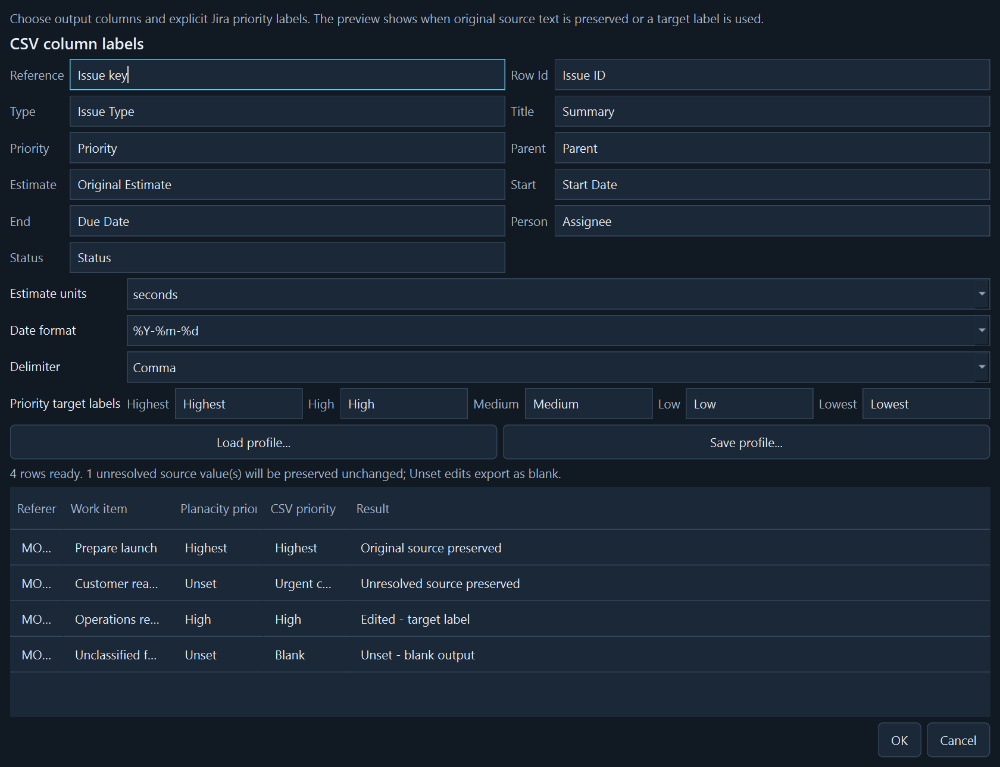
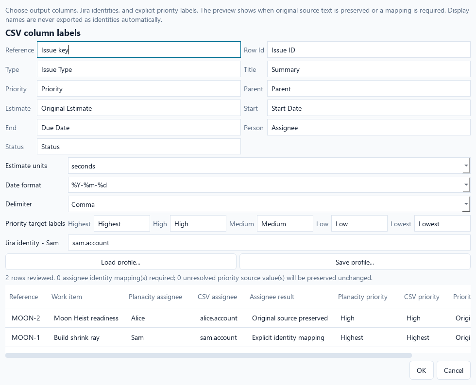
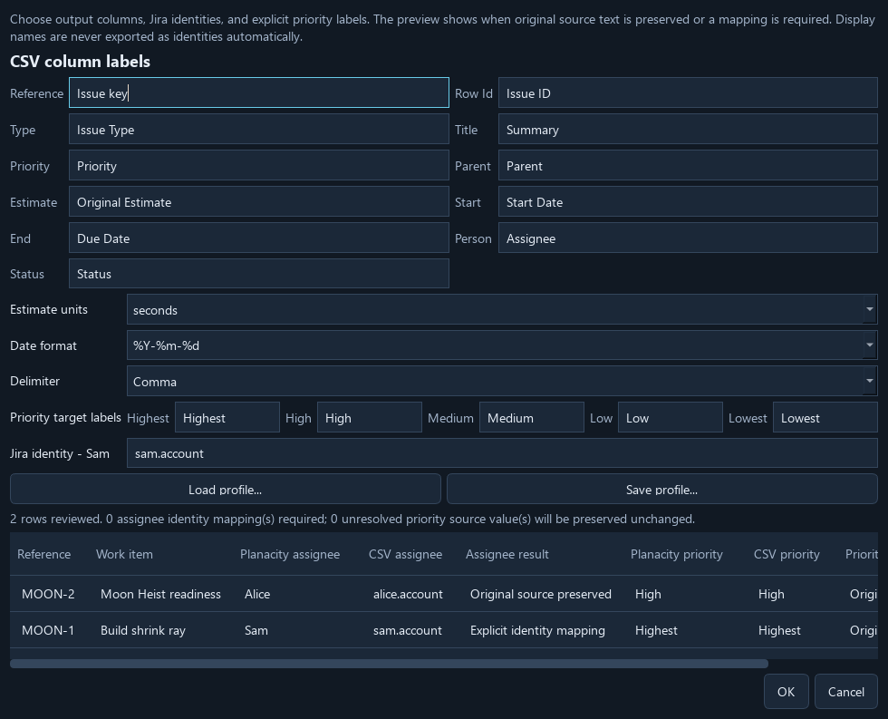
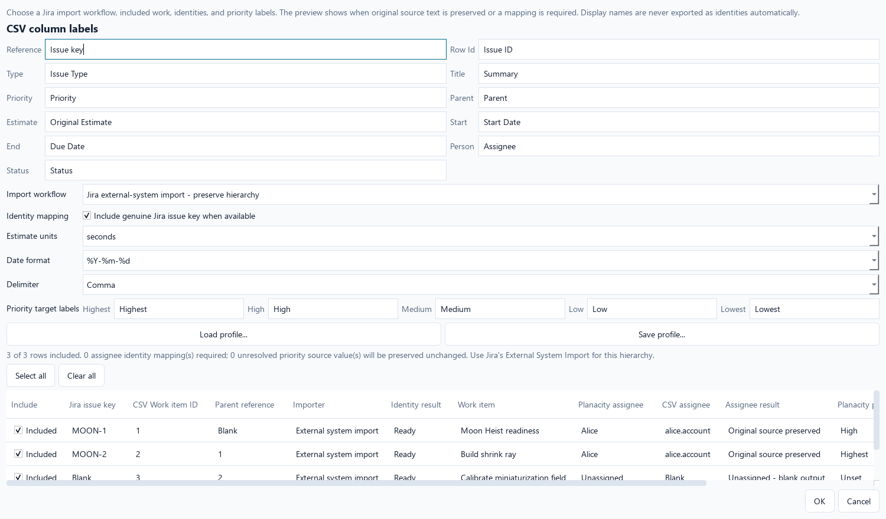
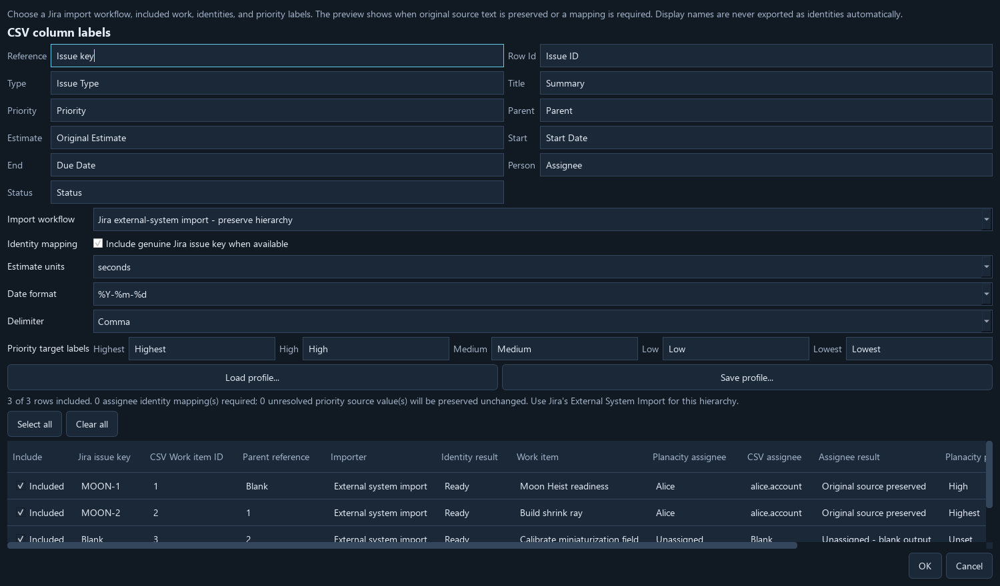

# Export Jira CSV

Choose **Import -> Export Jira CSV...**. Select a Jira import workflow, choose
which work rows to include, and review the distinct Jira key, temporary CSV ID,
parent reference, assignee, and priority results before selecting a `.csv`
destination. Excluding a row changes only this CSV. It does not remove work from
the Planacity project, its imported baseline, or Jira.

The two workflows are:

- **Jira external-system import - preserve hierarchy** includes Work item ID and
  Parent. Planacity generates deterministic sequential IDs for this export only,
  writes parents before children, and requires every selected child's parent to
  be selected. Jira site or organization admin access may be required.
- **Flat CSV import - omit hierarchy** leaves out Work item ID and Parent. It is
  suitable for standalone rows and workflows that do not need Planacity's
  hierarchy. A selected child is deliberately exported as flat work.

The genuine Jira issue-key column is a separate option in both workflows. It
preserves keys from imported work and stays blank for locally created work. A
temporary Work item ID is never stored as a Jira key or written back to the
Planacity project. Select all and Clear all provide keyboard-accessible bulk
selection. Zero selected rows, a selected child with an excluded parent in
hierarchy mode, and invalid identity mappings disable export with an actionable
message.

The delimiter comes from the Import page. Existing-file replacement uses the
file dialog's confirmation. The active project cannot be replaced with a CSV
export.

Export includes:

- Original external issue keys for imported work; blank keys for new work.
- Optional unique sequential Work item IDs, with parents before children and
  Parent referring to those export-local IDs.
- Canonical Epic, Task, and Sub-task types, title, estimate, and planned dates.
- Canonical assignees under an explicit identity-preservation rule, plus original
  statuses for imported work.
- Priority output chosen by a visible preservation rule.

The exporter uses canonical `WorkItem.assignee_id`, never a roster display name or
a guessed value from capacity totals. If imported ownership is unchanged, it
preserves the original external assignee text exactly. Changed or new ownership
requires a Jira identity entered for that roster person in this export dialog;
missing identities disable export. A cleared assignee exports blank. These
identity entries are deliberately not stored in reusable export profiles.

Jira import sets canonical ownership without inventing allocated hours. An Epic
assignee is its feature owner and creates no capacity demand. A Task/Subtask's
single Allocation remains the capacity record and planning services keep its
person aligned with the canonical assignee. Legacy multi-person allocations stay
visible until explicitly resolved; export never chooses one of them automatically.

When imported work keeps its baseline canonical priority, export preserves its
nonblank source priority text exactly. This includes unresolved custom values
whose Planacity priority remains Unset. When priority changes, export uses the
configured target label for Highest, High, Medium, Low, or Lowest. New work uses
the same explicit labels. Unset work without preserved source text exports blank.
Target labels must be nonblank and unique ignoring case; conflicts disable export
and remain visible in the dialog. The preview explains each row before writing.
Use **Save profile...** to retain the selected workflow, issue-key choice,
output headers, units, date format, delimiter, and all five target labels in a
local JSON file. Version 1 export profiles remain readable and select the
hierarchical workflow. Jira person identities and per-item selections stay out
of that file. **Load profile...** validates the
complete profile before changing the dialog. Export profiles contain no work rows,
people, or source data and cannot replace the active project.

Actual priority export preview in both appearances:

Canonical ownership and explicit Jira identity mapping in both appearances:

Work selection and separate Jira/CSV identities in both appearances:

Hours are exported as seconds by default. The column labels can be changed to
match your Jira configuration. Jira's importer requires its own field mapping,
date configuration, permissions, and validation. Review its preview before
applying changes. Planacity does not upload anything to Jira.

Hierarchy rollups do not replace stored export values. A container's exported
estimate is its entered/imported reference value, not its computed leaf total.
Derived totals remain visible in Plan and allocation summaries, so an export
never silently rewrites Jira effort or its imported baseline.

Atlassian documents unique Work item IDs for CSV hierarchy, Parent values that
reference those IDs, and parent-first row ordering in its
[CSV import guide](https://support.atlassian.com/jira-cloud-administration/docs/import-data-from-a-csv-file/).
Atlassian also states that its simpler
[bulk CSV importer](https://support.atlassian.com/jira-software-cloud/docs/create-issues-using-the-csv-importer/)
cannot map a multi-level parent-child hierarchy; use External System Import for
that workflow. Different Jira configurations may require different mappings.

## Boundaries

This export sends the agreed work structure. It omits WorkGroups, relationships,
roster-only people, and unmapped source columns. Those stay in the local project
and JSON backup. It is not a complete project backup. The initial exporter uses
canonical types even when an external type was mapped differently on import.

Removed work is omitted from the CSV; this does not delete issues in Jira.
New work receives its real external key only after Jira creates the issue.
Export does not rewrite the source snapshot or clear the Changes view.

CSV cells retain user text, including formula-like strings. Import the file
directly into Jira; if inspecting it in spreadsheet software, import columns as
text to avoid spreadsheet interpretation changing the data.
