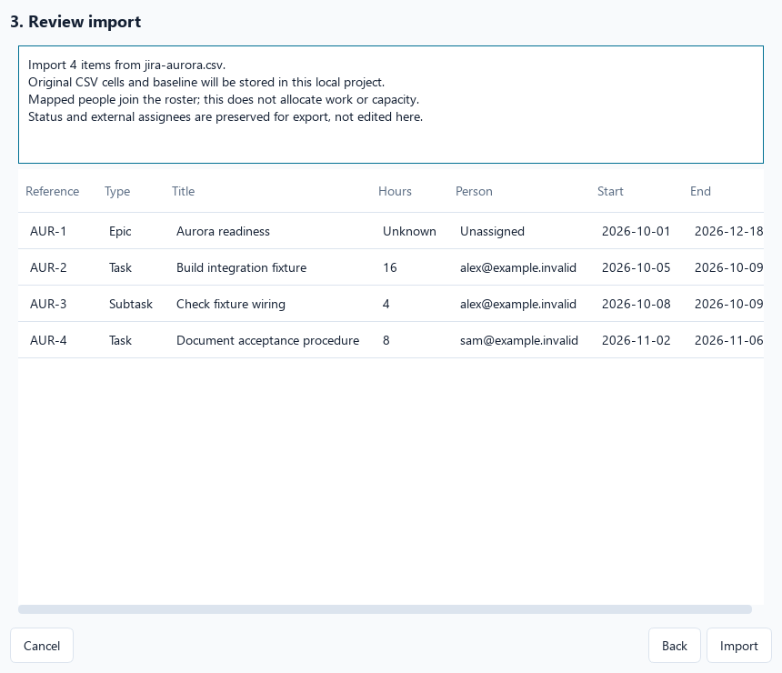
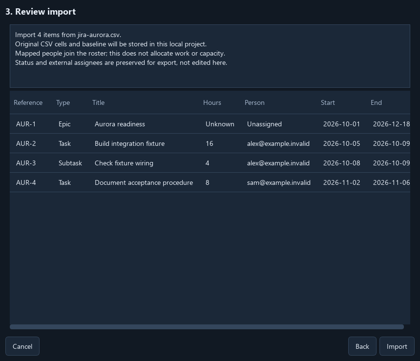
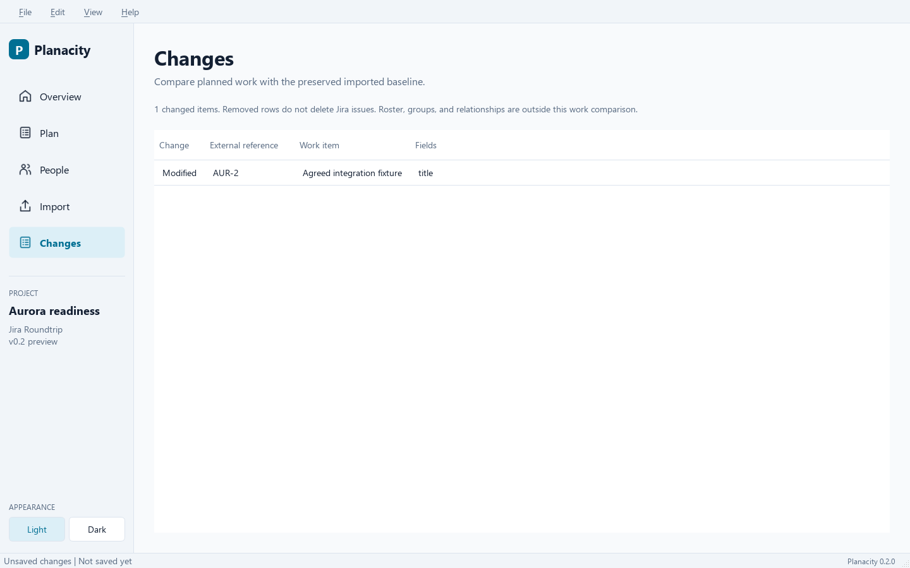
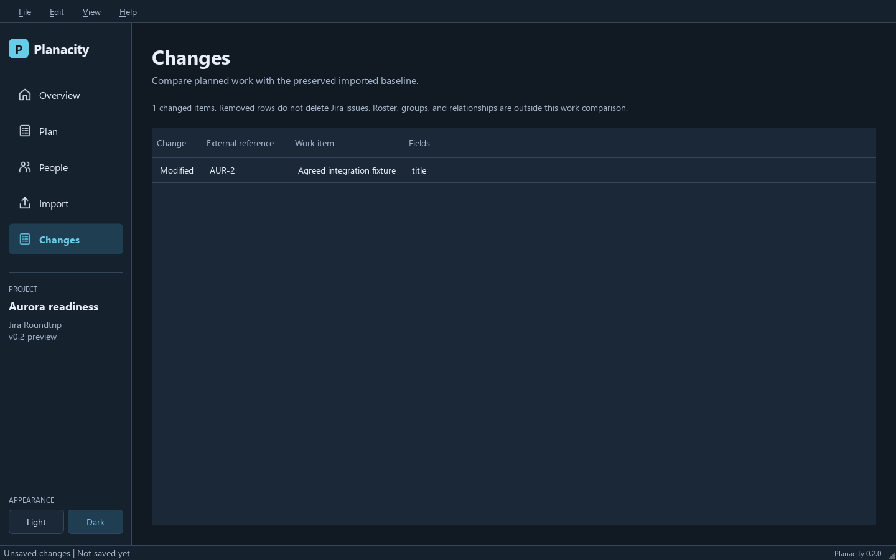

# Import Jira CSV

Create or open a Program Plan, then choose **Import -> Import Jira CSV...**.
Select the delimiter before choosing a UTF-8 file. UTF-8 BOMs, quoted commas,
multiline cells, and repeated column headers are supported. Other encodings
must be converted explicitly before import. No Jira credentials or network
connection are used.

1. Review the detected column mapping. Title, work type, and external reference
   are required. Columns are identified by position, including repeated headers.
   Map numeric issue IDs to **Row ID** when Parent contains those numbers.
   Otherwise, Parent must contain external references. Include all parent rows.
2. Choose **seconds** or **hours** for estimates and the exact date format.
   Story points are not hours and are never converted automatically. Blank
   estimates remain unknown; zero remains zero. Dates outside the plan horizon
   are retained and flagged in the Plan view.
3. Map every external type to Epic, Task, or Subtask. Unsupported types such as
   Story require an explicit choice; their original cells remain in the source.
   If Priority is mapped, review each distinct nonblank source value. Highest,
   High, Medium, Low, and Lowest receive case-insensitive default suggestions.
   Custom labels remain **Unmapped -> Unset** until you choose a canonical value.
   Blank and unresolved values never silently become Medium.
   Match each nonblank external person to a roster entry or explicitly create
   one. This records identity mapping, not work allocations or capacity.
4. Review the complete preview and choose **Import**. Errors keep the wizard open;
   Cancel leaves the document unchanged. Imported work is added to the active
   plan, which becomes unsaved until you save it.

Use `examples/jira-aurora.csv` for a fictional example. Map its two external
people to new or existing roster entries. Default units are seconds and its
dates use `%Y-%m-%d`.

## Profiles

Use **Save profile...** and **Load profile...** on the column-mapping page to
reuse a local JSON profile. After choosing custom type mappings, go Back to the
first page to save them. Priority value mappings follow the same workflow.
Profiles require the same headers in the same order;
they never silently adapt a changed CSV. They contain column names, positions,
type and priority-value mappings, units, and date format, not CSV rows or person
identities. Version 1 profiles remain readable; newly saved version 2 profiles
include priority mappings.
Profiles with duplicate JSON fields are rejected rather than choosing one value.
Remove the duplicate fields or save a new profile from the wizard. A failed load
keeps the current mapping unchanged.

## Preserved baseline

The project stores original cell values, including unmapped fields, together
with original work items, external references, original status, original priority
text, and person mapping snapshots. The mapped canonical priority is stored on
the baseline WorkItem separately from that source text. Editing or removing local
work does not rewrite either value.
JSON backups retain it too. Keep these files local if the imported data is
sensitive. Baseline person names remain even if a roster entry is later removed.

New CSV sources may be added when their external references are distinct.
Duplicate references, unknown parents, invalid hierarchy, dates, or estimates
block the complete import. Re-import reconciliation belongs to v0.8; importing
the same references again is deliberately rejected.

Seconds are converted to decimal hours with Python's default 28 significant
digit precision. Original CSV values remain available in the baseline; exports
restore integral seconds when the difference is only division roundoff.

## Changes

**Changes** (Ctrl+5) lists added, modified, and removed work against all imported
work snapshots. It compares title, type, parent, estimate, dates, and priority. Work with
no imported snapshot appears as Added once a baseline exists. Roster changes,
WorkGroups, and relationships are outside this initial comparison. Status and
external assignees are preserved for export and are not editable in v0.2.

## Validation record

The P02 checks cover all canonical levels, exact default suggestions, custom and
repeated values, blanks, visible unresolved values, import profile v1/v2
compatibility, reusable export profiles, CSV escaping, priority Changes,
schema 1-9 migration, and baseline-preserving export. The complete suite passes
756 tests; three focused dialogs also pass with Qt's native Windows plugin.
Ruff, mypy, and source/wheel builds pass. Both appearances were captured from the
real Qt mapping and export dialogs with fictional data.

The Windows/Python 3.12/PySide6 6.11.2 checks cover import mapping and correction,
preview cancellation, explicit type and people mapping, profile reuse, the real
import/export dialogs, baseline preservation after edits and save/reopen, and
protection of the active project during export. Native Windows acceptance passed
20 UI tests spanning the roundtrip and existing manual planning workflows.
The full automated suite passed 197 tests. Website and package builds passed.
GitHub CI also checks Windows and Linux with Python 3.11 and 3.13.

Real screenshots using only the fictional example:

