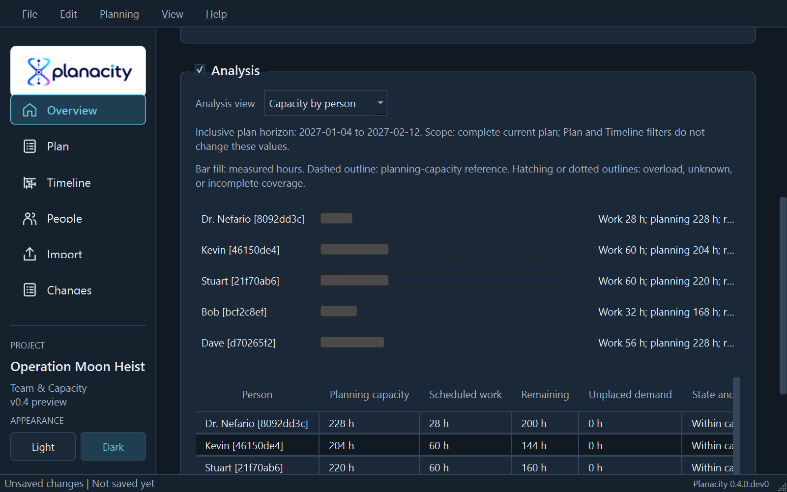
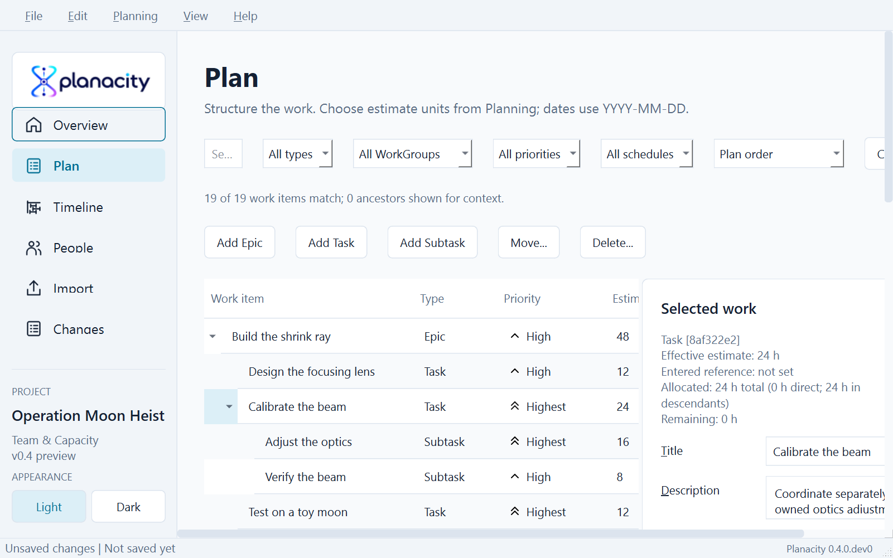
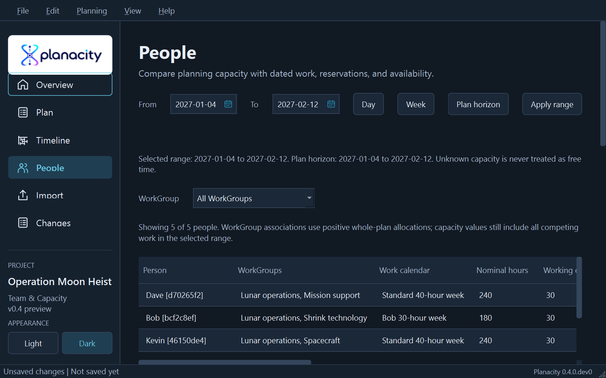
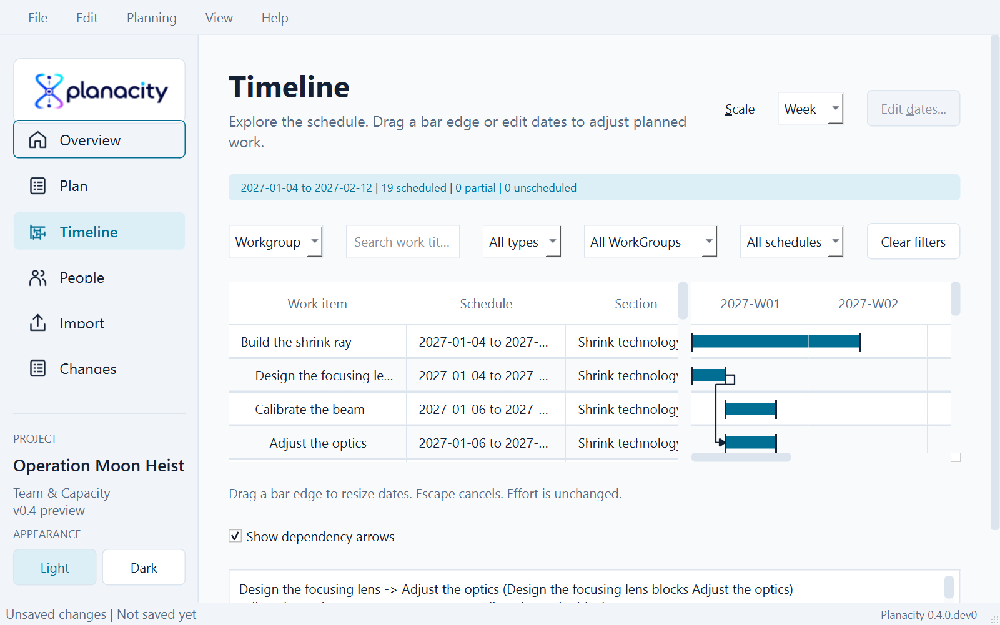

# Operation Moon Heist: demonstration specification

Status: implemented D01 dataset for v0.4.
This is a playful fictional plan inspired by Gru and the minions: prepare a
shrink ray, build a banana-powered spacecraft, capture the Moon, and bring it
home for a triumphant demonstration. Write original scenario text; use real
Planacity screenshots rather than film stills or mock application images.

Restore `examples/moon-heist.planacity.json` to open an unsaved copy. Save that
copy under a new name before trying the exercises. The supplied backup uses
schema 11 and stable UUIDv5 identities. `examples/jira-moon-heist.csv` reproduces
the six imported shrink-technology rows kept in the saved baseline.

## Cast and structure

Gru is the program sponsor in the plan description. The allocatable roster is
Dr. Nefario, Kevin, Stuart, Bob, and Dave. Give each a calendar; do not treat a
person's name or fictional role as a productivity rating.

| WorkGroup / Epic | Example leaf work | People |
| --- | --- | --- |
| Shrink technology / Build the shrink ray | Design lens, calibrate beam, test on a toy moon | Dr. Nefario, Bob |
| Spacecraft / Prepare the banana rocket | Assemble propulsion, integrate guidance, rehearse launch | Kevin, Stuart |
| Lunar operations / Capture and return | Confirm flight plan, fly to the Moon, shrink and retrieve, return home | Kevin, Bob, Dave |
| Mission support / Prepare the secret base | Stock bananas, prepare hangar, document the demonstration | Stuart, Dave |

Use 4 Epics and approximately 12-16 leaf tasks. Include one Task with two
Subtasks so rollups are visible. Container estimates are derived, not allocated
again. Create each leaf through the compact one-person assignment fields; a
collaborative parent has separately assigned subtasks and shows their contributor
team as a read-only aggregate. Epic feature owners add no capacity demand. At
least one person works across WorkGroups. Priorities and descriptions are visible
only after their corresponding fields are implemented.

## Deterministic planning inputs

Use the fixed horizon 2027-01-04 through 2027-02-12, not today's date. Choose
stable IDs so screenshots, CSV references, and validation results are repeatable.

- Standard calendar: Monday-Friday, 8 h/day. Bob: Monday-Friday, 6 h/day.
- Weekly mission briefing: 2 h/person per full Monday-anchored weekly period.
- Kevin's front office duty: 4 h/week, separately named and visible.
- Stuart unavailable on 2027-01-18; store only unavailable capacity, not HR detail.
- Example collaborative parent: calibrate beam, 24 h from two subtasks:
  adjust optics (Nefario, 16 h) and verify beam (Bob, 8 h).
- Set every baseline leaf estimate equal to its single positive allocation.
  Schedule dependent leaves with predecessor end strictly before successor start.
- Include independent support work and parallel prerequisites converging on
  launch. Do not encode hierarchy or `related_to` as scheduling edges.

These inputs produce the following tested results. Daily feasibility is checked
for every person and date; a green total alone is not accepted as evidence.
For a reproducible check, one full standard week has 40 nominal hours and 38
planning hours after briefing; Kevin has 34 after both duties. Bob has 28.
These checks assume no absence in that week.

| Person | Nominal | Unavailable | Reserved | Planning | Work | Remaining |
| --- | ---: | ---: | ---: | ---: | ---: | ---: |
| Dr. Nefario | 240 h | 0 h | 12 h | 228 h | 28 h | 200 h |
| Kevin | 240 h | 0 h | 36 h | 204 h | 60 h | 144 h |
| Stuart | 240 h | 8 h | 12 h | 220 h | 60 h | 160 h |
| Bob | 180 h | 0 h | 12 h | 168 h | 32 h | 136 h |
| Dave | 240 h | 0 h | 12 h | 228 h | 56 h | 172 h |
| **Plan** | **1,140 h** | **8 h** | **84 h** | **1,048 h** | **236 h** | **812 h** |

Allocated effort by reporting topic is 48 h for Shrink technology, 60 h for
Spacecraft, 76 h for Lunar operations, and 52 h for Mission support. Kevin works
across Spacecraft and Lunar operations; Dave works across Lunar operations and
Mission support. Calibrate the beam derives 24 h from Adjust the optics (16 h,
Dr. Nefario) and Verify the beam (8 h, Bob), without assigning or estimating the
parent again.

## Guided review exercises

Start with complete calendars, estimates, allocations, feasible daily demand,
and valid dependencies. A new user should understand the plan before repairing
it. Perform each exercise in a restored copy, with expected findings in the guide.

1. Select Kevin in People and use the plan horizon. His 240 nominal hours deduct
   12 h of briefings and 24 h of front-office duty, leaving 204 h planning
   capacity. His 36 h in Spacecraft plus 24 h in Lunar operations leave 144 h.
   Overview shows the same values.
2. In a restored copy, change Rehearse the launch from 12 h to 16 h and match its
   Allocation. Its 2027-01-18 to 2027-01-19 window then demands 8 h/day against
   Kevin's 6.8 h/day planning capacity. Expect a 1.2 h overload on each day,
   2.4 h total, with 1.2 h as the peak daily overload.
3. In separate restored copies, clear Stock mission bananas' estimate to produce
   Missing estimate, or remove Bob's work-calendar assignment to produce Missing
   work calendar. Bob's capacity becomes Unknown, never zero or free time.
4. Try moving Fly to the Moon from 2027-01-20 to 2027-01-19. Rehearse the launch
   ends that day, so the one-day dependency conflict is rejected and the original
   date remains. Moving the start to 2027-01-21 is permitted and leaves its 24 h
   estimate and Allocation unchanged.
5. Change Test on a toy moon's description and priority, save, and reopen. Changes
   reports the priority edit. Jira export uses the configured target priority for
   the current item while the saved MH-6 baseline retains its original Highest
   source value.
6. After V04/V06 ship, inspect the fork/join neighbourhood and critical overlay.
   Document why high priority and criticality can differ.

## Packaging and scope

The acceptance test validates restoring, saving, reopening, exact fixture totals,
daily feasibility, clean findings, and CSV provenance without relying on today.
`aurora.planacity.json` remains unchanged with its legacy-schema tests.

Future first-class milestones and deliveries belong to v0.6. Until then, mission
outcomes stay in prose; no zero-duration work impersonates those entities.

## Real application views

Each view was captured from the supplied backup on Windows in both appearances.

