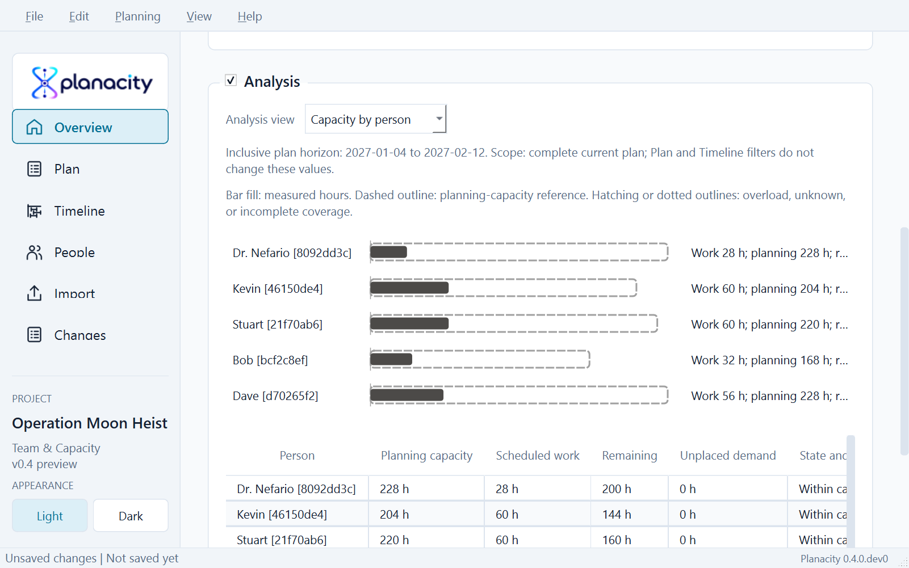
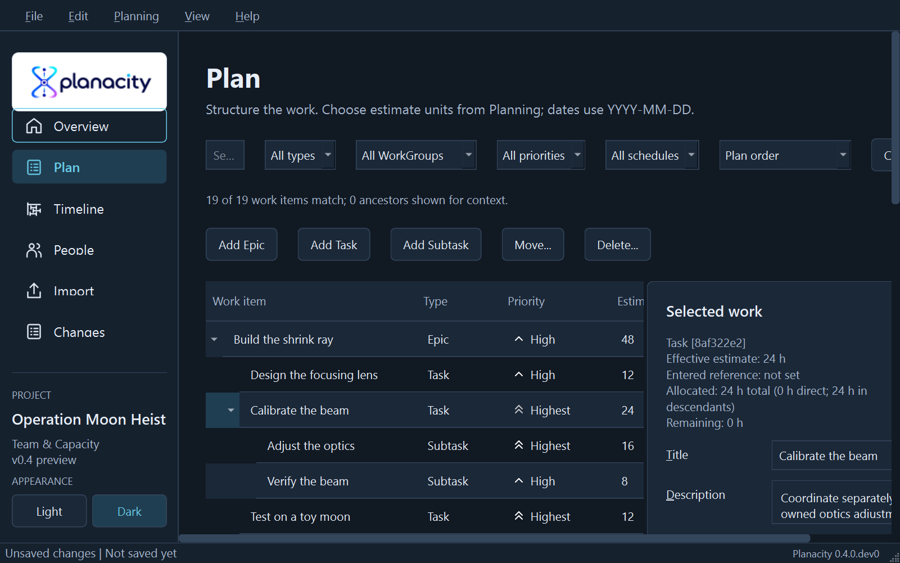
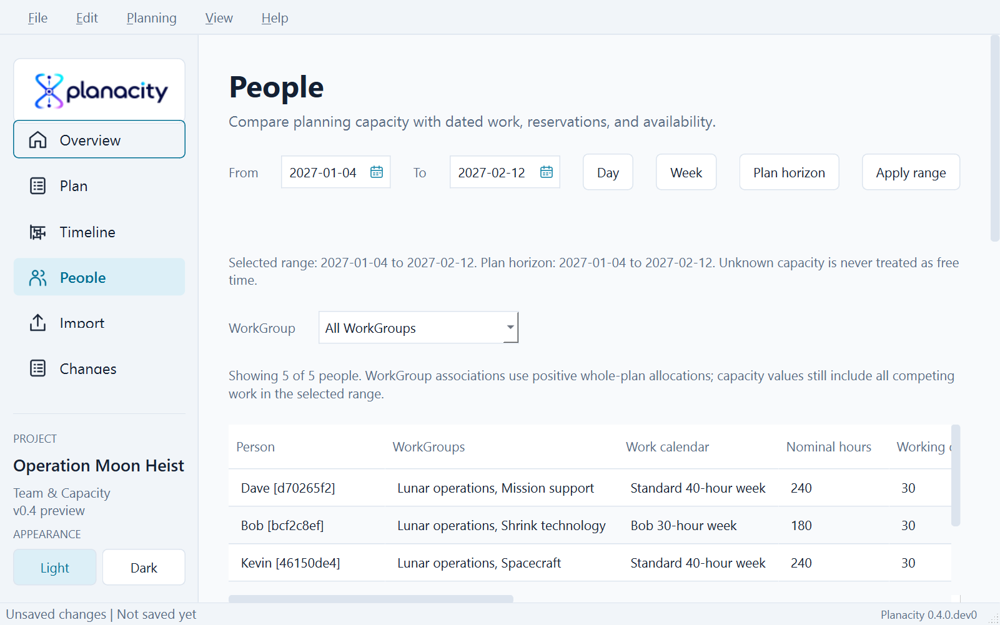
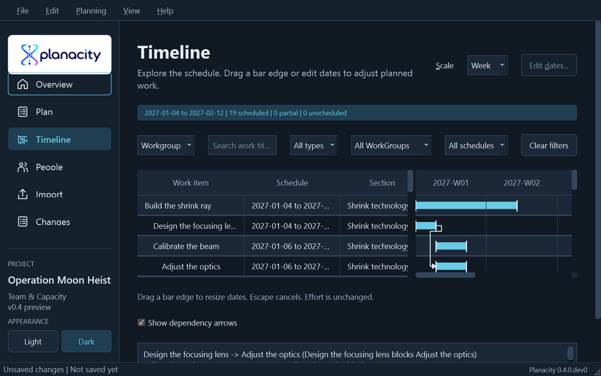

# Planacity examples

All example data is fictional and contains no real company, customer, or
employee information. Restore a JSON backup through File -> Restore JSON
backup... It opens as an unsaved copy, so save it to a new `.planacity` file
before making changes.

## Operation Moon Heist

`moon-heist.planacity.json` is the complete v0.4 demonstration. Gru sponsors a
playful program with five allocatable people, four WorkGroups, four Epics, one
collaborative Task split into separately owned Subtasks, and fourteen executable
leaves. Every leaf has dates, a description, priority, one canonical assignee,
and one matching positive Allocation. Epic feature owners add no capacity demand.

The fixed horizon is 2027-01-04 through 2027-02-12. The example includes:

- standard 40-hour calendars and Bob's explicit 30-hour calendar;
- a 2 h weekly mission briefing for everyone;
- Kevin's separate 4 h weekly front-office duty;
- Stuart's full unavailability on 2027-01-18;
- 236 h of dated work across four reporting topics;
- twelve valid dependency edges, including parallel prerequisites that converge
  on launch;
- an unchanged Jira baseline for the shrink-technology branch; and
- no initial planning findings, unplaced work, dependency conflicts, or overloads.

The exact capacity contract is tested and documented in the
[Moon Heist walkthrough](../docs/moon-heist-example.md). A matching six-row Jira
sample is available as `jira-moon-heist.csv`.

Real application views:

## Aurora Test Bench

This fictional program demonstrates manual planning and v0.3 Visual Planning. All names and
work are invented; it contains no real company or customer data.

Use File -> Restore JSON backup... and select aurora.planacity.json. It opens
as an unsaved copy. Save it to a new .planacity file before continuing.

The example includes two Epics, Tasks and Subtasks, a three-person roster, a
WorkGroup, relationships, fractional hour estimates, and optional dates. Missing
estimates/dates are intentional. The roster does not imply work allocations.

See [Getting started](../docs/getting-started.md) for the full workflow.

## Visual Planning walkthrough

Open Timeline (Ctrl+3) and compare Day, Week, and Month. The initial summary is
9 scheduled items, 2 partial items, and 1 unscheduled item.

- Group by Epic or WorkGroup; standalone work remains in an explicit section.
- Filter to Start only to find Arrange fixture transport. Receive calibration
  certificate has only an end date; Write handover notes has neither date.
- Search for procurement to see an outside-horizon warning. Its actual start is
  September 28, before the October 1 horizon; the date is not silently clamped.
- Clear filters and choose Week to see the three dependency arrows. Select
  Assemble test bench to inspect its predecessor and successor relationships.
- Drag its right edge from October 21 to October 24. The duration changes while
  its 40-hour estimate stays fixed. Escape cancels a preview; release applies it.
- Save to a new project, reopen, and continue. The supplied JSON remains unchanged.

This remains a schema 1 backup to exercise backward compatibility. Restoring and
saving produces the current project format. The roster is not an
allocation model, and the example contains no synthetic zero-duration milestones.

## Jira roundtrip sample

`jira-aurora.csv` is a fictional Jira-style export for v0.2. Choose Import,
keep comma delimiter, use seconds and ISO dates, and explicitly match or create
the two example people. Repeated Labels columns demonstrate source preservation.
See [the import guide](../docs/jira-import.md) and
[the export guide](../docs/jira-export.md).

Aurora remains unchanged as the legacy migration and incomplete-planning sample.
